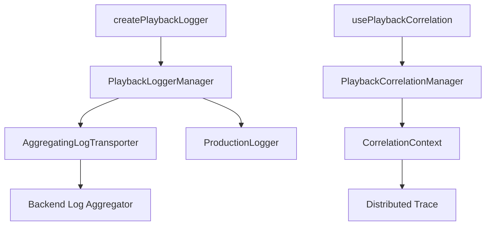

# Playback Domain Logging Module

## Overview

This module provides enhanced logging infrastructure for the playback domain, implementing Phase 5.1.3 and 5.1.4 of the God Objects Refactoring Plan. It adds advanced capabilities on top of the existing BassNotion logging infrastructure.

## Features

### 🔄 Log Aggregation (Phase 5.1.3)

- **Smart Batching**: Groups logs into batches for efficient transmission
- **Sampling**: Configurable sampling rates to reduce log volume in production
- **Deduplication**: Prevents duplicate logs within a time window
- **Aggregation**: Combines similar logs with occurrence counts
- **Performance-aware**: Built-in timing and threshold monitoring

### 🔗 Correlation ID Support (Phase 5.1.4)

- **Hierarchical Tracking**: Parent-child relationships for nested operations
- **Cross-Component Propagation**: Seamless context passing
- **Distributed Tracing**: Full operation traces across services
- **Async Operation Wrapping**: Automatic tracking of promises
- **Multi-Protocol Support**: HTTP, WebSocket, and Web Workers

## Installation

The module is part of the playback domain and doesn't require separate installation. Import from:

```typescript
import {
  createPlaybackLogger,
  usePlaybackCorrelation,
  // ... other exports
} from '@/domains/playback/modules/logging';
```

## Quick Start

### Basic Logging with Aggregation

```typescript
import { createPlaybackLogger } from '@/domains/playback/modules/logging';

const logger = createPlaybackLogger('MyComponent');

// Logs are automatically aggregated and batched
logger.info('Component initialized');
logger.debug('Processing item', { itemId: 123 }); // May be sampled
logger.error('Operation failed', { error }); // Always logged
```

### Correlation ID Tracking

```typescript
import { usePlaybackCorrelation } from '@/domains/playback/modules/logging';

function AudioPlayer() {
  const { correlationId, propagator, wrapAsync } =
    usePlaybackCorrelation('AudioPlayer');

  const loadTrack = async (trackId: string) => {
    return wrapAsync(
      async () => {
        // All operations are tracked with correlation ID
        const response = await fetch(`/api/tracks/${trackId}`);
        return response.json();
      },
      'loadTrack',
      { trackId },
    );
  };
}
```

### Performance Logging

```typescript
import { createPerformanceLogger } from '@/domains/playback/modules/logging';

const { logger, startTimer } = createPerformanceLogger('AudioProcessor', {
  warning: 50, // Warn if > 50ms
  error: 200, // Error if > 200ms
});

const timer = startTimer('processAudio');
// ... do work ...
timer(); // Automatically logs performance metrics
```

## Architecture

### Components

1. **LogAggregationPatterns.ts**
   - `AggregatingLogTransporter`: Core aggregation engine
   - Sampling rules and presets
   - Batch management and compression support

2. **PlaybackLoggerIntegration.ts**
   - `PlaybackLoggerManager`: Singleton coordinator
   - Integration with existing `ProductionLogger`
   - Environment-specific configurations

3. **CorrelationIdSupport.ts**
   - `PlaybackCorrelationManager`: Correlation context management
   - `CorrelationPropagator`: Cross-component propagation
   - Decorators and React hooks

### Integration Points



## Configuration

### Aggregation Configuration

```typescript
const logger = createPlaybackLogger('MyComponent', {
  aggregation: {
    batchSize: 100, // Logs per batch
    batchTimeout: 5000, // Max time before flush (ms)
    samplingRate: 0.5, // Sample 50% of logs
    enableDeduplication: true, // Remove duplicates
    aggregationWindow: 60000, // Aggregate similar logs over 1 minute
    samplingRules: [
      { level: 'error', rate: 1.0 }, // Always log errors
      { pattern: /critical/i, rate: 1.0 }, // Always log critical
    ],
  },
});
```

### Environment Presets

```typescript
import { SAMPLING_PRESETS } from '@/domains/playback/modules/logging';

// Development: Full logging
const devLogger = createPlaybackLogger('Dev', {
  aggregation: SAMPLING_PRESETS.development,
});

// Production: Optimized sampling
const prodLogger = createPlaybackLogger('Prod', {
  aggregation: SAMPLING_PRESETS.production,
});

// Performance: Aggressive sampling
const perfLogger = createPlaybackLogger('Perf', {
  aggregation: SAMPLING_PRESETS.performance,
});
```

## Usage Patterns

### 1. Component Logging

```typescript
export class AudioComponent {
  private logger = createPlaybackLogger('AudioComponent');

  async initialize(): Promise<void> {
    this.logger.info('Initializing audio component');

    try {
      await this.loadSamples();
      this.logger.info('Audio component initialized');
    } catch (error) {
      this.logger.error('Failed to initialize', { error });
      throw error;
    }
  }
}
```

### 2. Correlation Decorators

```typescript
export class AudioService {
  @Correlated('loadSamples')
  async loadSamples(instrumentId: string): Promise<void> {
    // Method is automatically wrapped with correlation tracking
    const samples = await fetch(`/api/samples/${instrumentId}`);
    return samples.json();
  }
}
```

### 3. Cross-Service Correlation

```typescript
const manager = PlaybackCorrelationManager.getInstance(eventBus);
const propagator = manager.createPropagator(correlationId);

// HTTP requests with correlation
const fetch = propagator.createFetch();
const response = await fetch('/api/endpoint');

// WebSocket with correlation
const ws = propagator.createWebSocket('ws://localhost:8080');

// Worker with correlation
const worker = propagator.createWorker('/worker.js');
```

### 4. Distributed Tracing

```typescript
const orchestrator = new TransportOrchestrator();

// Execute complex operation
await orchestrator.orchestratePlayback(trackId);

// Get full trace
const trace = await orchestrator.getPlaybackTrace(correlationId);
console.log('Operation trace:', trace);
```

## Advanced Features

### Custom Sampling Rules

```typescript
const logger = createPlaybackLogger('HighFrequency', {
  aggregation: {
    samplingRules: [
      // Always log errors and warnings
      { level: 'error', rate: 1.0 },
      { level: 'warn', rate: 0.9 },

      // Sample debug logs heavily
      { level: 'debug', rate: 0.01 },

      // Always log specific patterns
      { pattern: /payment|auth/i, rate: 1.0 },

      // Sample performance logs by category
      { category: 'performance', level: 'info', rate: 0.1 },
    ],
  },
});
```

### Operation Cancellation

```typescript
const manager = PlaybackCorrelationManager.getInstance(eventBus);

try {
  await complexOperation(correlationId);
} catch (error) {
  // Cancel all operations associated with this correlation ID
  manager.cancelCorrelation(correlationId);
}
```

### Batch Processing with Correlation

```typescript
async function processBatch(items: any[]) {
  const { correlationId, wrapAsync } = usePlaybackCorrelation('BatchProcessor');

  const results = await Promise.all(
    items.map((item, index) =>
      wrapAsync(() => processItem(item), `processItem[${index}]`, {
        itemId: item.id,
      }),
    ),
  );

  // Get complete trace of batch processing
  const trace = manager.getTrace(correlationId);
}
```

## Performance Considerations

### Memory Management

- Contexts are automatically cleaned up after 5 minutes
- Deduplication cache has a sliding window
- Batch size limits prevent memory bloat

### CPU Usage

- Sampling reduces processing overhead
- Aggregation reduces log volume
- Pattern matching is optimized for performance

### Network Traffic

- Batching reduces HTTP requests
- Compression support (when implemented)
- Retry logic with exponential backoff

## Troubleshooting

### Logs Not Appearing

1. Check sampling configuration - you may be sampling too aggressively
2. Verify log level meets minimum threshold
3. Check if deduplication is filtering repeated logs
4. Ensure batches are being flushed (check batch timeout)

### High Memory Usage

1. Reduce aggregation window
2. Decrease batch size
3. Enable more aggressive sampling
4. Check for correlation context leaks

### Correlation Not Working

1. Ensure correlation ID is being propagated
2. Check that all components use the same EventBus instance
3. Verify WebSocket/Worker initialization includes correlation
4. Check backend accepts correlation headers

## Migration Guide

### From Direct console.log

```typescript
// Before
console.log('Loading samples');

// After
const logger = createPlaybackLogger('SampleLoader');
logger.info('Loading samples');
```

### From Basic Structured Logger

```typescript
// Before
const logger = createStructuredLogger('Component');

// After - with all enhancements
const logger = createPlaybackLogger('Component');
```

### Adding Correlation to Existing Code

```typescript
// Before
async function loadAudio() {
  const response = await fetch('/api/audio');
  return response.json();
}

// After
async function loadAudio() {
  const { wrapAsync } = usePlaybackCorrelation('AudioLoader');

  return wrapAsync(async () => {
    const response = await fetch('/api/audio');
    return response.json();
  }, 'loadAudio');
}
```

## Examples

See the `examples/` directory for complete examples:

- `LoggingPatternExamples.ts` - Various logging patterns
- `CorrelationIdExamples.ts` - Correlation ID usage patterns

## Best Practices

1. **Use Appropriate Log Levels**
   - `debug`: Detailed information for debugging
   - `info`: General operational information
   - `warn`: Warning conditions that should be reviewed
   - `error`: Error conditions that need immediate attention

2. **Structure Your Logs**
   - Always include relevant context
   - Use consistent property names
   - Include correlation IDs for async operations

3. **Configure for Your Environment**
   - Use full logging in development
   - Apply sampling in production
   - Monitor aggregation stats

4. **Correlation ID Usage**
   - Create at operation boundaries
   - Propagate through all async calls
   - Include in error reports

## API Reference

### createPlaybackLogger

```typescript
function createPlaybackLogger(
  name: string,
  options?: {
    correlationId?: string;
    aggregation?: Partial<LogAggregationConfig>;
  },
): StructuredLogger;
```

### usePlaybackCorrelation

```typescript
function usePlaybackCorrelation(
  componentName: string,
  parentCorrelationId?: string,
): {
  correlationId: string;
  propagator: CorrelationPropagator;
  wrapAsync: <T>(
    operation: () => Promise<T>,
    operationName: string,
    metadata?: Record<string, any>,
  ) => Promise<T>;
};
```

### @Correlated Decorator

```typescript
@Correlated(operationName?: string)
method(...args: any[]): Promise<any>
```

## Contributing

When adding new features to this module:

1. Follow the established patterns
2. Add comprehensive examples
3. Update this README
4. Ensure backward compatibility
5. Add tests for new functionality

## Related Documentation

- [God Objects Refactoring Plan](../../GOD_OBJECTS_REFACTORING_PLAN.md)
- [Phase 5 Implementation Plan](../../PHASE_5_IMPLEMENTATION_PLAN.md)
- [BassNotion Logging Guide](../../../../../../../../../docs/developer-handbook/DEVELOPER_GUIDE.md#logging)
