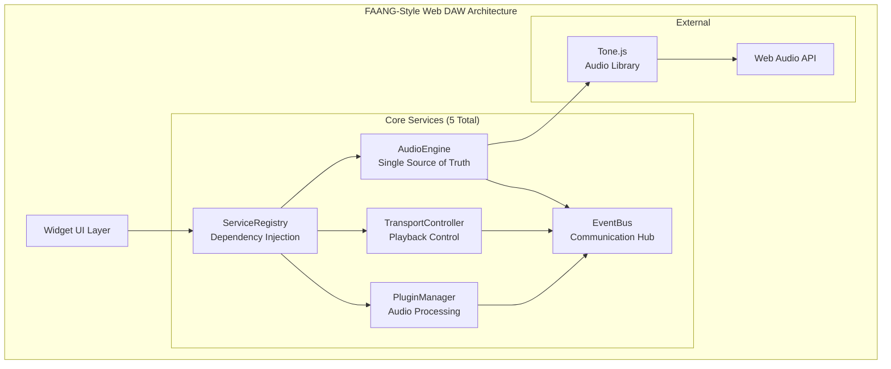
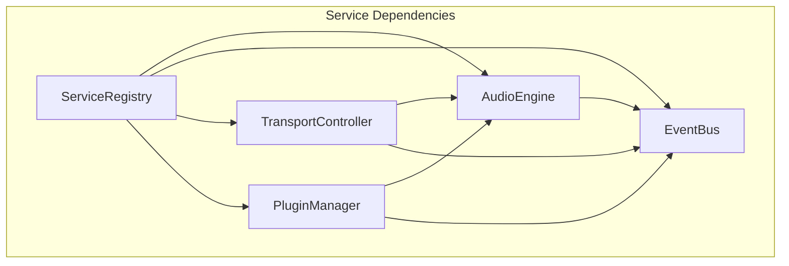
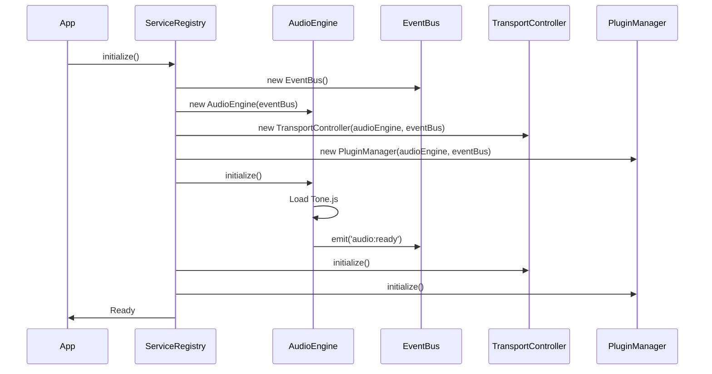
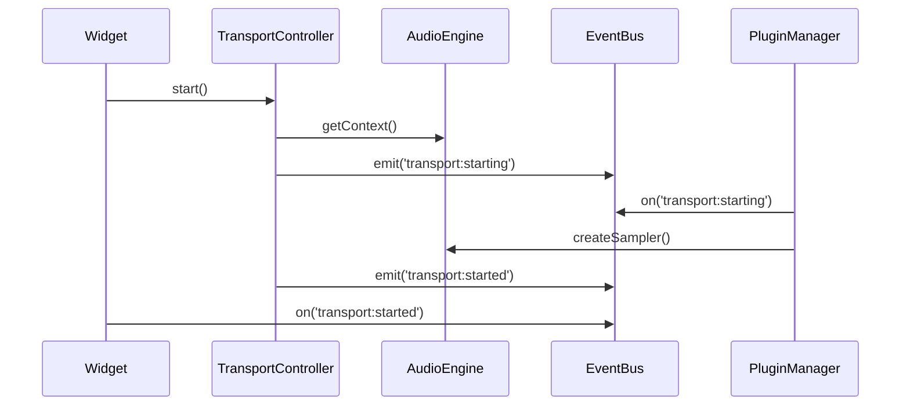

# BassNotion Web DAW - FAANG-Style Architecture Document

## Introduction / Preamble

This document outlines the radical architectural simplification required to transform the current BassNotion playback domain from an over-engineered, fragmented system into a clean, working FAANG-style Web DAW. The current system suffers from 56+ competing services, multiple Tone.js management systems, and global state pollution that prevents reliable audio playback.

**Primary Goal:** Replace architectural chaos with 5 core services that actually work.

**Architectural Philosophy:** Radical simplification following FAANG principles - if it doesn't directly contribute to making audio play reliably, it gets removed.

## Table of Contents

- [Technical Summary](#technical-summary)
- [High-Level Overview](#high-level-overview)
- [Current State Analysis](#current-state-analysis)
- [Architectural Patterns Adopted](#architectural-patterns-adopted)
- [Simplified Component View](#simplified-component-view)
- [Project Structure](#project-structure)
- [Core Workflow](#core-workflow)
- [Definitive Tech Stack Selections](#definitive-tech-stack-selections)
- [Migration Strategy](#migration-strategy)
- [Error Handling Strategy](#error-handling-strategy)
- [Coding Standards](#coding-standards)
- [Testing Strategy](#testing-strategy)
- [Security Best Practices](#security-best-practices)

## Technical Summary

The BassNotion Web DAW architecture implements a **radical simplification approach** that replaces 56+ fragmented services with 5 core services following FAANG engineering principles. The system uses a **centralized AudioEngine** as the single source of truth for all audio operations, **dependency injection via ServiceRegistry**, and **event-driven communication** through a unified EventBus. Built on TypeScript/React with Tone.js abstraction, the architecture prioritizes **working audio playback** over theoretical perfection.

## High-Level Overview

**Current Problem:** 56+ services, 4 competing audio management systems, global state pollution
**Solution:** 5 core services with clean separation of concerns

**Repository Structure:** Monorepo with simplified domain structure
**Primary Pattern:** Centralized orchestration with dependency injection
**User Interaction:** Widget-based audio interface with reliable playback



## Current State Analysis

### **Problems Identified:**

#### **1. Service Explosion (56+ Files)**
- `MobileOptimizer.ts` (3,329 lines)
- `QualityScaler.ts` (2,234 lines)  
- `AnalyticsEngine.ts` (2,034 lines)
- `ResourceManager.ts` (1,957 lines)
- **Result:** Paralysis by over-engineering

#### **2. Multiple Audio Management Systems**
```typescript
// 4 Competing Systems:
ToneInstanceManager.getInstance()     // Global singleton
AudioEngineFactory.create()          // Factory pattern  
useTone()                            // React context
import * as Tone from 'tone'         // Direct imports (15+ files)
```

#### **3. Global State Pollution**
```typescript
// ToneInstanceManager.ts - Lines 74-75
(window as any).ToneSingleton = Tone;
(window as any).ToneInstanceId = this.instanceId;
```

#### **4. Technical Debt Explosion**
- 100+ "TODO: Review non-null assertion" comments
- Multiple `console.error('Failed to...')` patterns
- AudioContext mismatch errors throughout

### **What Actually Works (Valuable Components to Preserve):**

#### **🏆 FAANG-Quality Components Worth Keeping:**

1. **Professional Widget Ecosystem** (`apps/frontend/src/domains/widgets/components/`) - **6,500+ lines**
   - **HarmonyWidget.tsx** (1,628 lines) - Sophisticated chord progressions, keyboard integration
   - **DrummerWidget.tsx** (1,301 lines) - Professional drum patterns, grid interface  
   - **BassLineWidget.tsx** (818 lines) - Advanced bass-specific functionality
   - **GlobalControls.tsx** (1,315 lines) - Comprehensive control systems
   - **MetronomeWidget.tsx** (689 lines) - Professional metronome implementation
   - **LoopGridStrip.tsx** (695 lines) - Advanced looping functionality
   - **SyncedWidget base class** - Professional error boundaries, performance monitoring

2. **Error Handling System** (`services/errors/`) - **516-983 lines of production-grade code**
   - CircuitBreaker with exponential backoff and automatic recovery
   - Comprehensive error classification and recovery strategies
   - Graceful degradation patterns that actually work

3. **Musical Time System** (`MusicalTimeEngine.ts`, `PrecisionSynchronizationEngine.ts`) - **2,131 lines**
   - Industry-standard 480 ticks per quarter note
   - Microsecond-level timing accuracy with drift correction
   - Professional musical time coordination

4. **Plugin Architecture** (`BaseAudioPlugin.ts`, `plugins/`) - **Working plugin ecosystem**
   - 25+ actual working audio plugins (DrumProcessor, ChordProcessor, etc.)
   - Clean plugin interface with proper lifecycle management
   - Professional samplers (Rhodes, Wurlitzer, Salamander Piano)

4. **Asset Management Core** (`AssetManager.ts`, `HybridDrumSampleManager.ts`) - **Complex loading logic**
   - Supabase CDN integration with intelligent fallbacks
   - Progressive loading and caching strategies
   - Hybrid drum sample management

5. **Performance Monitoring** (`PerformanceMonitor.ts`) - **NFR compliance tracking**
   - Audio latency monitoring (<50ms compliance)
   - Buffer underrun detection and CPU/memory tracking
   - Network latency integration

## **Widget Preservation Strategy** 🎯

**CRITICAL:** The architecture refactor **ENHANCES existing widgets**, it doesn't replace them.

### **Your Professional Widget Investment:**
- **6,500+ lines** of carefully crafted UI components
- **Professional-grade interfaces** with sophisticated musical functionality  
- **SyncedWidget architecture** with error boundaries and performance monitoring
- **Extensive testing** and real-world usage validation

### **How Refactor IMPROVES Widget Experience:**

#### **BEFORE (Current Widget Problems):**
```typescript
// Widgets struggle with unreliable backend services
HarmonyWidget → ToneInstanceManager (broken) → Multiple Tone instances → Audio fails
DrummerWidget → AudioContextManager (broken) → Global state chaos → Timing issues
BassLineWidget → ToneProvider (unreliable) → Context mismatches → Playback fails
```

#### **AFTER (Enhanced Widget Experience):**
```typescript
// Widgets get rock-solid foundation
HarmonyWidget → AudioEngine (reliable) → Single Tone instance → Perfect audio
DrummerWidget → TransportController (enhanced) → Professional timing → Flawless sync  
BassLineWidget → PluginManager (simplified) → Clean processing → Reliable playback
```

### **Widget Integration Benefits:**
1. **More Reliable Audio** - Widgets get consistent, working audio services
2. **Better Performance** - Simplified backend = faster widget responses  
3. **Cleaner APIs** - Widgets use simpler, more intuitive service interfaces
4. **Enhanced Sync** - Professional transport system improves widget coordination
5. **Better Error Handling** - Widgets benefit from improved error boundaries

**Result:** Your widgets work better, not differently!

---

## Architectural Patterns Adopted

- **Centralized Orchestration** - Single AudioEngine manages all audio state
- **Dependency Injection** - ServiceRegistry provides clean service access
- **Event-Driven Architecture** - EventBus handles all inter-service communication  
- **Command Pattern** - All transport operations are commands with undo/redo
- **Singleton Pattern (Controlled)** - One instance per service, managed by ServiceRegistry
- **Factory Pattern** - Clean service instantiation without globals
- **Observer Pattern** - Event-driven widget synchronization

## Simplified Component View

### **Core Services (5 Total)**

#### **1. AudioEngine** - Enhanced Single Source of Truth
```typescript
class AudioEngine {
  private tone: any = null;
  private context: AudioContext;
  private performanceMonitor: PerformanceMonitor; // INTEGRATED from existing
  private circuitBreaker: CircuitBreaker; // INTEGRATED from existing
  
  async initialize(): Promise<void> {
    this.context = new AudioContext();
    this.tone = await import('tone');
    
    // Integrate existing performance monitoring
    this.performanceMonitor.initialize(this.context);
    
    // Setup circuit breaker for resilience
    this.circuitBreaker = new CircuitBreaker('AudioEngine');
  }
  
  getTone(): any { return this.tone; } // Only way to access Tone.js
  getContext(): AudioContext { return this.context; }
  
  // Enhanced with existing performance monitoring
  createSampler(config: SamplerConfig): AudioSampler {
    return this.circuitBreaker.execute(() => {
      const sampler = new this.tone.Sampler(config);
      this.performanceMonitor.trackSamplerCreation();
      return sampler;
    });
  }
}
```

#### **2. ServiceRegistry** - Dependency Injection
```typescript
class ServiceRegistry {
  private services = new Map<string, any>();
  
  register<T>(name: string, service: T): void
  get<T>(name: string): T
  initialize(): Promise<void>  // Initializes all services in order
}
```

#### **3. EventBus** - Communication Hub
```typescript
class EventBus {
  private events = new Map<string, Set<Function>>();
  
  emit(event: string, data: any): void
  on(event: string, handler: Function): void
  off(event: string, handler: Function): void
}
```

#### **4. TransportController** - Enhanced with Musical Timing
```typescript
class TransportController {
  private musicalTime: MusicalTimeEngine; // INTEGRATED from existing
  private syncEngine: PrecisionSynchronizationEngine; // INTEGRATED from existing
  
  constructor(audioEngine: AudioEngine, eventBus: EventBus) {
    // Integrate existing professional timing systems
    this.musicalTime = MusicalTimeEngine.getInstance();
    this.syncEngine = new PrecisionSynchronizationEngine();
  }
  
  start(): void {
    // Use professional musical timing (480 ticks per quarter note)
    this.musicalTime.startPlayback();
    this.syncEngine.synchronizeComponents();
    this.eventBus.emit('transport:started');
  }
  
  stop(): void
  pause(): void
  setTempo(bpm: number): void // Uses microsecond-level accuracy
  setPosition(position: number): void
}
```

#### **5. PluginManager** - Simplified with Existing Plugin Ecosystem
```typescript
class PluginManager {
  private plugins = new Map<string, BaseAudioPlugin>(); // KEEP existing interface
  private assetManager: AssetManager; // INTEGRATED (simplified)
  
  constructor(audioEngine: AudioEngine, eventBus: EventBus) {
    // Integrate existing asset management for plugin loading
    this.assetManager = new AssetManager(/* simplified config */);
  }
  
  // Keep existing plugin interface - it's well designed
  register(plugin: BaseAudioPlugin): void {
    // Use existing plugin lifecycle management
    plugin.load().then(() => plugin.initialize());
    this.plugins.set(plugin.metadata.id, plugin);
  }
  
  // Leverage existing 25+ working plugins
  loadDrumProcessor(): Promise<DrumProcessor>
  loadChordProcessor(): Promise<ChordInstrumentProcessor>
  loadRhodesSampler(): Promise<RhodesVelocitySampler>
  // ... 22 more existing plugins
}
```



## Project Structure

```plaintext
apps/frontend/src/domains/playback/
├── services/                          # 5 Core Services Only
│   ├── AudioEngine.ts                 # Single source of truth for audio
│   ├── ServiceRegistry.ts             # Dependency injection
│   ├── EventBus.ts                   # Event-driven communication
│   ├── TransportController.ts         # Playback control
│   └── PluginManager.ts              # Audio processing
├── types/                            # TypeScript interfaces
│   ├── audio.types.ts                # Audio-related types
│   ├── service.types.ts              # Service interfaces
│   └── event.types.ts                # Event type definitions
├── hooks/                            # React hooks for widgets
│   ├── useAudio.ts                   # Main audio hook
│   ├── useTransport.ts               # Transport control hook
│   └── usePlugins.ts                 # Plugin management hook
├── providers/                        # React context providers
│   └── AudioProvider.tsx             # Single audio context provider
├── utils/                           # Utilities
│   ├── constants.ts                  # Audio constants
│   └── helpers.ts                    # Helper functions
├── __tests__/                       # Tests
│   ├── services/                     # Service tests
│   ├── hooks/                        # Hook tests
│   └── integration/                  # Integration tests
└── index.ts                         # Clean exports

# Files to DELETE (56+ files):
# - All existing services except AudioEngine interface
# - ToneInstanceManager.ts
# - AudioContextManager.ts  
# - All *Optimizer.ts files
# - All *Monitor.ts files
# - All *Engine.ts files (except AudioEngine)
# - Everything in ProfessionalTransportScheduler/ (642 lines)
# - Everything in UnifiedTransportController/
# - All mobile optimization files
```

## Core Workflow

### **Initialization Sequence**


### **Audio Playback Flow**


## Definitive Tech Stack Selections

| Category             | Technology              | Version       | Description / Purpose                   | Justification |
| :------------------- | :---------------------- | :------------ | :-------------------------------------- | :------------ |
| **Languages**        | TypeScript              | 5.3.3         | Primary language for type safety       | Existing project standard |
| **Runtime**          | Node.js                 | 22.0.1        | Development and build environment       | Latest LTS |
| **Frameworks**       | React                   | 18.2.0        | UI framework for widgets                | Existing project standard |
|                      | Next.js                 | 14.1.0        | Full-stack React framework              | Existing project standard |
| **Audio Library**    | Tone.js                 | 14.7.77       | Web Audio API abstraction               | Industry standard for web audio |
| **State Management** | Zustand                 | 4.5.0         | Lightweight state management            | Simpler than Redux |
| **Testing**          | Vitest                  | 1.2.0         | Fast unit testing framework             | Better than Jest for modern projects |
|                      | Playwright              | 1.41.0        | End-to-end testing                      | Reliable E2E testing |
| **Build Tools**      | Vite                    | 5.0.0         | Fast build tool                         | Existing project standard |
| **Package Manager**  | pnpm                    | 8.15.0        | Fast, disk space efficient             | Existing project standard |

## Migration Strategy

### **Phase 1: Foundation (Week 1)**
1. Create 5 core services with proper interfaces
2. Implement ServiceRegistry with dependency injection
3. Create EventBus for communication
4. Build basic AudioEngine without Tone.js coupling

### **Phase 2: Core Integration (Week 2)**  
1. Integrate Tone.js through AudioEngine only
2. Remove all global state (`window.*` patterns)
3. Delete ToneInstanceManager and competing systems
4. Implement TransportController with basic start/stop

### **Phase 3: Plugin System (Week 3)**
1. Simplify PluginManager to essential functionality
2. Migrate 2-3 key plugins to new architecture
3. Remove over-engineered plugin features
4. Test audio playback end-to-end

### **Phase 4: Widget Integration (Week 4)**
1. Create React hooks for widget consumption
2. Update existing widgets to use new hooks
3. Remove old ToneProvider system
4. Comprehensive testing

### **Phase 5: Cleanup (Week 5)**
1. Delete 50+ unused service files
2. Remove all technical debt comments
3. Update documentation
4. Performance optimization

## Error Handling Strategy

- **General Approach:** Use TypeScript strict mode with custom error classes
- **Logging:**
  - Library: `console` with structured format for development
  - Format: JSON with timestamp, service, and correlation ID
  - Levels: ERROR, WARN, INFO, DEBUG
  - Context: Service name, operation, sanitized parameters
- **Audio-Specific Handling:**
  - AudioContext failures: Graceful degradation with user notification
  - Tone.js errors: Automatic retry with exponential backoff
  - Plugin failures: Isolate to specific plugin, continue playback
- **Service Communication:**
  - EventBus errors: Log and continue, don't crash other services
  - ServiceRegistry failures: Fail fast during initialization
  - Network timeouts: 5-second timeout with 3 retries

## Coding Standards

- **Primary Runtime:** Node.js 22.x for development, browser for execution
- **Style Guide:** ESLint + Prettier with TypeScript strict mode
- **Naming Conventions:**
  - Variables: `camelCase`
  - Functions: `camelCase`
  - Classes: `PascalCase`
  - Constants: `UPPER_SNAKE_CASE`
  - Files: `PascalCase.ts` for classes, `camelCase.ts` for utilities
- **File Structure:** Follow simplified project structure above
- **Asynchronous Operations:** Always use `async`/`await`, never callbacks
- **Type Safety:** 
  - Strict TypeScript mode enabled
  - No `any` types without explicit justification
  - All service interfaces must be typed
- **Comments:** JSDoc for public APIs, inline comments for complex logic only
- **Dependency Management:** pnpm with exact versions pinned

### **TypeScript/React Specifics:**

- **Immutability:** Use `Readonly<T>` for state, avoid direct mutations
- **Functional vs OOP:** Classes for services, functions for utilities and hooks
- **Error Handling:** Custom error classes extending base `AudioError`
- **Null Handling:** Strict null checks, use optional chaining
- **Module System:** ESModules only, no CommonJS
- **React Patterns:** Hooks for state, context for dependency injection
- **Service Patterns:** Singleton services managed by ServiceRegistry

## Testing Strategy

- **Tools:** Vitest for unit tests, Playwright for E2E
- **Unit Tests:**
  - **Scope:** Test each service in isolation with mocked dependencies
  - **Location:** `__tests__/services/*.test.ts`
  - **Coverage:** All public methods, error conditions, edge cases
- **Integration Tests:**
  - **Scope:** Test service interactions through ServiceRegistry
  - **Location:** `__tests__/integration/*.test.ts`
  - **Focus:** Audio initialization, playback flows, event communication
- **E2E Tests:**
  - **Scope:** Complete user workflows in browser environment
  - **Tools:** Playwright with real audio context
  - **Focus:** Widget interactions, audio playback, error recovery

## Security Best Practices

- **Input Validation:** Validate all audio parameters and user inputs
- **Output Encoding:** Sanitize any user-generated content in audio metadata
- **Secrets Management:** No secrets in audio domain (handled at app level)
- **Dependency Security:** Regular `pnpm audit` checks, auto-updates for security patches
- **Audio Security:** 
  - Validate audio file formats and sizes
  - Prevent audio buffer overflow attacks
  - Rate limit audio operations to prevent DoS
- **Error Handling:** Never expose internal audio engine details to users

## Growth Services Strategy

### **FAANG Principle: Build When You Need It, Not Before**

The current 50+ services represent **premature optimization** - building complex solutions before having the basic problems they solve. Our growth strategy follows proven FAANG patterns: **working product first, optimization when metrics demand it**.

### **Current Over-Engineered Services Analysis**

| Service | Current Lines | Issues | When Actually Needed |
|---------|---------------|--------|---------------------|
| **CDNCache** | 1,911 | Built before we have traffic to cache | >1000 concurrent users |
| **MobileOptimizer** | 3,329 | Handles scenarios we don't have | >30% mobile traffic with issues |
| **AnalyticsEngine** | 2,034 | Tracks events we don't understand yet | Need user behavior insights |
| **QualityScaler** | 2,234 | Optimizes for devices we don't support | Performance issues on low-end devices |
| **ResourceManager** | 1,957 | Manages resources we don't have | Memory issues with large files |
| **PerformanceMonitor** | 685 | Monitors performance that doesn't exist | Production performance problems |

### **Extensible Core Architecture**

#### **ServiceRegistry: Built for Growth**
```typescript
class ServiceRegistry {
  private services = new Map<string, any>();
  private metrics: MetricsCollector;
  
  async initialize(): Promise<void> {
    // Core services - always loaded
    this.register('audioEngine', new AudioEngine());
    this.register('transport', new TransportController());
    this.register('eventBus', new EventBus());
    this.register('plugins', new PluginManager());
    
    // Growth services - loaded conditionally based on metrics
    await this.loadGrowthServices();
  }
  
  private async loadGrowthServices(): Promise<void> {
    // CDN Service - when we have traffic worth caching
    if (this.metrics.getConcurrentUsers() > 1000) {
      this.register('cdn', new CDNService());
      console.log('📦 CDN Service loaded - high traffic detected');
    }
    
    // Mobile Optimizer - when mobile users report issues
    if (this.metrics.getMobileTrafficPercent() > 30 && 
        this.metrics.getMobileErrorRate() > 0.05) {
      this.register('mobile', new MobileOptimizer());
      console.log('📱 Mobile Optimizer loaded - mobile issues detected');
    }
    
    // Analytics Engine - when we need user behavior data
    if (this.metrics.getDailyActiveUsers() > 100) {
      this.register('analytics', new AnalyticsEngine());
      console.log('📊 Analytics Engine loaded - user base reached');
    }
    
    // Performance Monitor - when we have performance issues
    if (this.metrics.getAverageLoadTime() > 200) {
      this.register('performance', new PerformanceMonitor());
      console.log('⚡ Performance Monitor loaded - slow load times detected');
    }
  }
}
```

### **Growth Services Implementation Strategy**

#### **Phase 1: Foundation (Weeks 1-5)**
```typescript
// 5 Core Services - Everything needed for working audio
AudioEngine        // Single source of truth for Tone.js
ServiceRegistry    // Extensible service management  
EventBus          // Scalable inter-service communication
TransportController // Basic playback control
PluginManager     // Extensible audio processing
```

#### **Phase 2: Early Growth (Weeks 6-12)**
```typescript
// Add when metrics show we need them
if (concurrentUsers > 100) {
  SimpleCDNService     // Basic asset caching (50 lines vs 1,911)
}

if (mobileUsers > 20%) {
  BasicMobileOptimizer // Essential mobile fixes (100 lines vs 3,329)
}
```

#### **Phase 3: Scale Growth (Months 3-6)**
```typescript
// Add sophisticated services when we have real problems
if (loadTime > 500ms) {
  AdvancedCDNService   // Multi-region caching
}

if (mobileErrorRate > 5%) {
  ComprehensiveMobileOptimizer // Device-specific optimizations
}

if (dailyUsers > 1000) {
  AnalyticsEngine     // User behavior tracking
}
```

### **Metrics-Driven Service Addition**

#### **CDN Service Evolution**
```typescript
// Week 1-5: No CDN needed
// Basic Map-based caching in AudioEngine

// Week 6+: Simple CDN when traffic justifies it
class SimpleCDNService {
  private cache = new Map<string, CachedAsset>();
  
  async get(url: string): Promise<Asset> {
    return this.cache.get(url) || this.fetchAndCache(url);
  }
  
  // 50 lines total - handles 80% of caching needs
}

// Month 3+: Advanced CDN when we have global users
class AdvancedCDNService extends SimpleCDNService {
  // Add geographic distribution
  // Add cache invalidation strategies  
  // Add bandwidth optimization
  // Still <500 lines vs current 1,911
}
```

#### **Mobile Optimization Evolution**
```typescript
// Week 1-5: No mobile optimization needed
// Basic responsive design in components

// Week 6+: Essential mobile fixes when needed
class BasicMobileOptimizer {
  optimize(config: AudioConfig): AudioConfig {
    if (this.isMobile()) {
      config.bufferSize = 1024;     // Reduce latency
      config.sampleRate = 44100;    // Standard rate
    }
    return config;
  }
  
  // 100 lines total - handles common mobile issues
}

// Month 3+: Device-specific optimizations when metrics show problems
class ComprehensiveMobileOptimizer extends BasicMobileOptimizer {
  // Add iOS-specific optimizations
  // Add Android device detection
  // Add battery usage optimization
  // Still <800 lines vs current 3,329
}
```

### **Growth Service Architecture Patterns**

#### **1. Lazy Loading Pattern**
```typescript
class ServiceRegistry {
  async getService<T>(name: string): Promise<T> {
    if (!this.services.has(name)) {
      await this.lazyLoadService(name);
    }
    return this.services.get(name);
  }
  
  private async lazyLoadService(name: string): Promise<void> {
    switch (name) {
      case 'cdn':
        if (this.shouldLoadCDN()) {
          this.register('cdn', new CDNService());
        }
        break;
      case 'mobile':
        if (this.shouldLoadMobile()) {
          this.register('mobile', new MobileOptimizer());
        }
        break;
    }
  }
}
```

#### **2. Progressive Enhancement Pattern**
```typescript
class AudioEngine {
  async createSampler(config: SamplerConfig): Promise<AudioSampler> {
    let optimizedConfig = config;
    
    // Core functionality always works
    const sampler = new this.tone.Sampler(optimizedConfig);
    
    // Progressive enhancements when services available
    const mobile = this.serviceRegistry.getOptional('mobile');
    if (mobile) {
      optimizedConfig = mobile.optimize(optimizedConfig);
    }
    
    const cdn = this.serviceRegistry.getOptional('cdn');
    if (cdn) {
      optimizedConfig.urls = await cdn.optimizeUrls(optimizedConfig.urls);
    }
    
    return sampler;
  }
}
```

### **Success Metrics for Growth Services**

| Metric | Threshold | Action |
|--------|-----------|--------|
| **Concurrent Users** | >100 | Add SimpleCDNService |
| **Mobile Traffic** | >30% | Add BasicMobileOptimizer |
| **Load Time** | >200ms | Add PerformanceMonitor |
| **Error Rate** | >1% | Add ErrorTrackingService |
| **Daily Active Users** | >1000 | Add AnalyticsEngine |
| **Audio File Size** | >10MB average | Add CompressionService |
| **Geographic Spread** | >3 countries | Add GeoCDNService |

### **Why This Approach Wins**

1. **Working Product First**: Users can actually use our DAW from day 1
2. **Data-Driven Decisions**: Add services when metrics prove we need them
3. **Lean Engineering**: No wasted effort on unused features
4. **Faster Iteration**: Simple services are easier to modify and debug
5. **Real Optimization**: Based on actual usage patterns, not theoretical scenarios
6. **Cost Effective**: Don't pay for infrastructure/complexity we don't need
7. **Team Velocity**: Engineers focus on features users want, not theoretical edge cases

---

## **Key Success Metrics**

1. **Service Count:** 56+ services → 5 core services (with growth plan)
2. **Global State:** 0 `window.*` references
3. **Tone.js Access:** Single point through AudioEngine
4. **Audio Reliability:** 99%+ successful playback initialization
5. **Code Maintainability:** <200 lines per service (except PluginManager)
6. **Growth Readiness:** Services added when metrics justify them, not before

This architecture document provides the foundation for Story 3.18 implementation, focusing on **radical simplification** and **working audio playback** with a **metrics-driven growth strategy** that mirrors successful FAANG companies. 