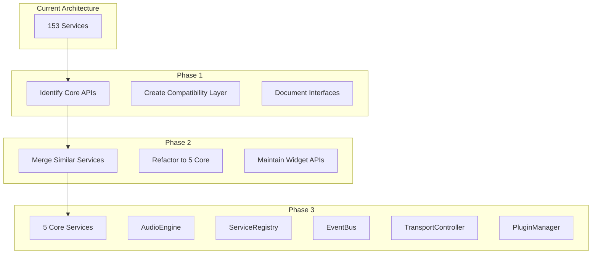

# Component Preservation Strategy

## Executive Summary

This document outlines the preservation strategy for transforming 153 playback services into 5 core FAANG-style services while preserving valuable functionality and ensuring zero regression.

**Key Statistics:**
- Total Services: 153
- Services to Keep: 24 (16%)
- Services to Integrate: 66 (43%)
- Services to Archive: 24 (16%)
- Services to Delete: 39 (25%)

## Categorization Criteria

### KEEP (Professional-Grade Core Services)
**Criteria:**
- Quality score ≥ 7/10
- Active widget dependencies
- Clean, well-defined interfaces
- Unique, valuable functionality
- Professional-grade implementation

**Examples:**
- AudioEngine (core audio abstraction)
- CorePlaybackEngine (main playback controller)
- UnifiedTransportController (transport synchronization)
- MusicalTimeEngine (musical timing calculations)

### INTEGRATE (Merge into Core Services)
**Criteria:**
- Small, focused functionality (< 500 LOC)
- Clear integration path to core services
- Currently scattered functionality
- Would benefit from consolidation

**Examples:**
- EventManager → EventBus
- StateManager → ServiceRegistry
- Various error handlers → Unified error system

### ARCHIVE (Keep for Reference)
**Criteria:**
- Good functionality but not immediately needed
- Over-engineered but potentially valuable at scale
- Complex optimizations for future use
- Educational value

**Examples:**
- AnalyticsEngine (1665 LOC)
- PredictiveLoadingEngine
- IntelligentCacheRouter

### DELETE (Remove Completely)
**Criteria:**
- Over-engineered with no clear value
- Duplicate functionality
- Poor quality implementation (< 4/10)
- No dependencies and no tests

**Examples:**
- DeviceInfoService (duplicate of browser APIs)
- GarbageCollectionOptimizer (browser handles this)
- N8nPayloadProcessor (obsolete integration)

## Preserved Components List

### Critical Services (Must Preserve)

1. **AudioEngine** (171 LOC)
   - Core audio abstraction layer
   - Dynamic Tone.js loading
   - AudioContext management

2. **CorePlaybackEngine** (593 LOC)
   - Central playback coordination
   - Widget dependencies: YouTubePlaybackSync, PlaybackOrchestrator
   - State management integration

3. **UnifiedTransportController** (Integration of multiple services)
   - Transport synchronization
   - Exercise timeline integration
   - Performance tracking

4. **MusicalTimeEngine** (Critical calculations)
   - Musical time conversions
   - Tempo-independent calculations
   - Widget timeline synchronization

5. **Professional Audio Processors**
   - ChordInstrumentProcessor (HarmonyWidget)
   - HybridDrumSampleManager (DrummerWidget)
   - EnhancedMetronomeProcessor
   - Various velocity samplers (Rhodes, Wurlitzer, etc.)

### Valuable Components (Selective Preservation)

1. **State Management**
   - ComprehensiveStateManager patterns
   - StatePersistenceManager approaches
   - Session state handling

2. **Performance Optimization**
   - Key algorithms from PerformanceOptimizationEngine
   - Useful patterns from QualityScaler
   - Mobile optimization strategies

3. **Audio Processing**
   - Mixing console algorithms
   - Transposition logic
   - Loop control mechanisms

## Integration Architecture Plan

### Target: 5 Core Services

#### 1. **AudioEngine** (Enhanced)
Integrates:
- AudioContextManager
- ToneInstanceManager
- AudioSourceManager
- BaseAudioPlugin framework
- All audio processors
- Sample managers

#### 2. **ServiceRegistry**
Integrates:
- StateManager components
- StatePersistenceManager
- Session management
- Configuration management

#### 3. **EventBus**
Integrates:
- EventManager patterns
- Transport event handling
- Widget synchronization events
- Performance event reporting

#### 4. **TransportController** (Unified)
Integrates:
- UnifiedTransportController
- ProfessionalTransportScheduler
- Timeline integration
- Loop control
- Tempo management

#### 5. **PluginManager**
Integrates:
- All instrument processors
- Effect processors
- MIDI processing
- Plugin lifecycle management

### Integration Approach



## Migration Timeline

### Week 1-2: Preparation
- Complete API documentation
- Create compatibility layers
- Set up feature flags
- Establish rollback procedures

### Week 3-4: Low-Risk Migration
- Delete identified services
- Archive selected services
- Begin integration of small services
- Validate no regression

### Week 5-6: Core Integration
- Merge services into 5 core
- Maintain parallel implementations
- Comprehensive testing

### Week 7-8: Finalization
- Remove old implementations
- Update all imports
- Performance optimization
- Final validation

## Risk Mitigation Strategy

### Backup Strategy
1. **Git Tags:** Tag repository before each phase
2. **Branch Strategy:** Separate branch for each core service
3. **Archive Storage:** Keep archived services in `/archived` directory
4. **Documentation:** Complete API docs before changes

### Testing Checkpoints
1. **Pre-Migration:** Full test suite pass
2. **Per-Service:** Test after each service change
3. **Integration Tests:** Widget functionality tests
4. **Performance Tests:** Ensure no degradation
5. **E2E Tests:** Full user journey validation

### Feature Flags
```typescript
const FEATURE_FLAGS = {
  useNewAudioEngine: false,
  useUnifiedTransport: false,
  useNewPluginSystem: false,
  // Gradual rollout per service
};
```

### Rollback Procedures

#### Immediate Rollback (< 1 hour)
1. Disable feature flag
2. Clear caches
3. Restart services

#### Phase Rollback (< 1 day)
1. Revert to git tag
2. Restore archived services
3. Update imports
4. Run validation suite

#### Complete Rollback (emergency)
1. Restore from backup branch
2. Revert all PRs
3. Notify all teams
4. Post-mortem analysis

## Success Metrics

### Quantitative Metrics
- Code reduction: Target 60% fewer files
- Performance: No degradation in load time
- Bundle size: Target 30% reduction
- Test coverage: Maintain > 80%

### Qualitative Metrics
- Developer experience improvement
- Cleaner architecture
- Better maintainability
- Easier onboarding

## Appendices

### A. Complete Service List
See `service-audit-categorized.csv` for full details

### B. Dependency Analysis
See `widget-service-dependencies.md` for widget impact

### C. Technical Details
See service-specific migration guides in `/docs/migration/`