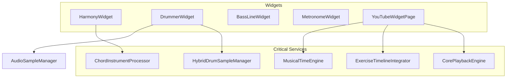

# Widget Service Dependencies Map

## Executive Summary

This document maps the dependencies between widgets and playback services, identifying critical preservation requirements for the Epic 3.18 architecture transformation.

**Key Findings:**

- 11 services have direct widget dependencies
- 7 services are critical for widget functionality
- 4 services can be safely refactored without widget impact

## Critical Widget Dependencies

### High Priority (Multiple Widget Dependencies)

#### 1. **CorePlaybackEngine**

- **Used by:** YouTubePlaybackSync, PlaybackOrchestrator
- **Category:** KEEP
- **Risk:** HIGH - Core functionality for playback coordination
- **Preservation:** Must maintain all public APIs

#### 2. **HybridDrumSampleManager**

- **Used by:** HybridDrumKitSelector, DrummerWidget
- **Category:** KEEP
- **Risk:** HIGH - Critical for drum functionality
- **Preservation:** Full preservation required

#### 3. **ExerciseTimelineIntegrator**

- **Used by:** ExerciseTimelineIndicator, useWidgetPageState
- **Category:** KEEP
- **Risk:** HIGH - Timeline synchronization
- **Preservation:** Maintain timeline APIs

#### 4. **MusicalTimeEngine**

- **Used by:** TempoIndependentExerciseLoader, PlaybackOrchestrator, Test suites
- **Category:** KEEP
- **Risk:** HIGH - Musical timing calculations
- **Preservation:** Core timing logic must be preserved

### Medium Priority (Single Widget Dependencies)

#### 5. **ChordInstrumentProcessor**

- **Used by:** HarmonyWidget
- **Category:** KEEP
- **Risk:** MEDIUM - Harmony widget functionality
- **Preservation:** Chord processing APIs

#### 6. **AudioSampleManager**

- **Used by:** DrummerWidget
- **Category:** KEEP
- **Risk:** MEDIUM - Sample loading functionality
- **Preservation:** Sample management APIs

#### 7. **PerformanceMonitor**

- **Used by:** PerformanceBaseline
- **Category:** INTEGRATE
- **Risk:** LOW - Can be integrated into core
- **Preservation:** Monitoring APIs only

## Widget Impact Assessment

### Widgets and Their Dependencies

### Service Usage by Domain

| Domain        | Service Count | Critical Services                             |
| ------------- | ------------- | --------------------------------------------- |
| Harmony       | 1             | ChordInstrumentProcessor                      |
| Drums         | 2             | HybridDrumSampleManager, AudioSampleManager   |
| Timeline      | 2             | ExerciseTimelineIntegrator, MusicalTimeEngine |
| Core Playback | 1             | CorePlaybackEngine                            |
| Performance   | 1             | PerformanceMonitor                            |

## Preservation Requirements

### Must Preserve (Widget Critical)

1. All public APIs used by widgets
2. Event interfaces for widget communication
3. State management interfaces
4. Sample loading and management APIs
5. Timeline synchronization protocols

### Can Modify (With Care)

1. Internal implementation details
2. Performance optimization code
3. Caching mechanisms
4. Error handling (maintain error types)

### Safe to Remove

1. Services with no widget dependencies
2. Test-only services
3. Deprecated APIs not used by widgets

## Migration Strategy for Widget Dependencies

### Phase 1: API Preservation

- Document all widget-facing APIs
- Create compatibility layers where needed
- Maintain backward compatibility

### Phase 2: Gradual Migration

- Move functionality to core services
- Update widgets one at a time
- Maintain parallel implementations during transition

### Phase 3: Cleanup

- Remove old implementations
- Update widget imports
- Verify all functionality preserved

## Risk Mitigation

### High-Risk Services (Multiple Dependencies)

- **Strategy:** Create detailed API documentation before changes
- **Testing:** Comprehensive widget integration tests
- **Rollback:** Feature flags for gradual rollout

### Medium-Risk Services (Single Dependencies)

- **Strategy:** Direct coordination with widget team
- **Testing:** Targeted widget functionality tests
- **Rollback:** Service-level feature toggles

### Low-Risk Services (No Dependencies)

- **Strategy:** Standard refactoring practices
- **Testing:** Unit tests sufficient
- **Rollback:** Git-based rollback

## Recommendations

1. **Prioritize Preservation:** Services with widget dependencies should be preserved or carefully integrated
2. **API Contracts:** Create explicit API contracts for widget-service interfaces
3. **Testing Strategy:** Implement comprehensive widget integration tests before any service changes
4. **Communication:** Close coordination with widget team throughout migration
5. **Phased Approach:** Migrate non-dependent services first to build confidence

## Appendix: Complete Dependency List

See `service-dependencies.txt` for the complete raw analysis of all service dependencies and inter-service relationships.
