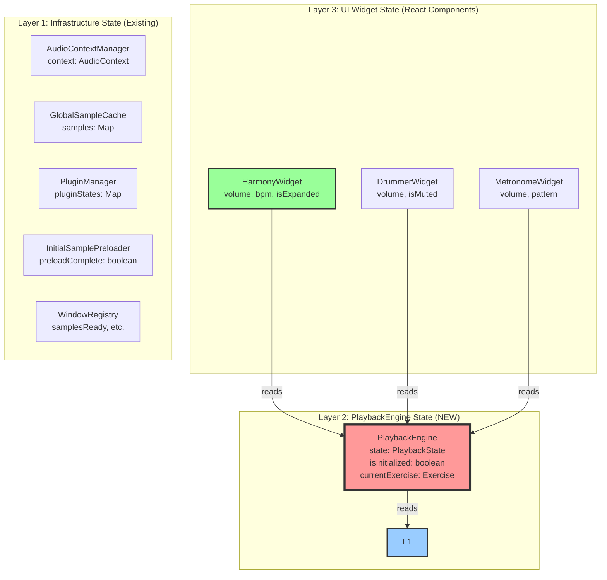
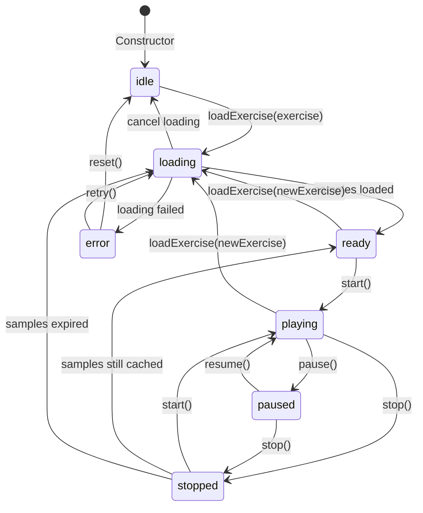

# State Consolidation Strategy: Current → PlaybackEngine Architecture

**Document Type:** Implementation Blueprint
**Task:** Phase 0, Task 0.1
**Date:** 2025-11-23
**Status:** Ready for Implementation
**Estimated Reading Time:** 30 minutes

---

## Executive Summary

This document defines the **3-layer state architecture** for the PlaybackEngine refactor and provides a complete migration strategy from the current 9+ fragmented state sources to a centralized, maintainable state model.

**Key Outcomes:**

1. ✅ Complete inventory of all 11 current state sources
2. ✅ 3-layer state architecture (Infrastructure | Playback | UI)
3. ✅ PlaybackEngine state machine with 7 states and 12 transitions
4. ✅ State transition matrix (old → new mapping)
5. ✅ Dual-engine synchronization strategy (Adapter Pattern)
6. ✅ Integration test specifications (30+ tests)

---

## Table of Contents

1. [Current State Inventory](#1-current-state-inventory)
2. [3-Layer State Architecture](#2-3-layer-state-architecture)
3. [PlaybackEngine State Machine](#3-playbackengine-state-machine)
4. [State Transition Matrix](#4-state-transition-matrix)
5. [Dual-Engine Synchronization Strategy](#5-dual-engine-synchronization-strategy)
6. [Integration Test Specifications](#6-integration-test-specifications)
7. [Migration Checklist](#7-migration-checklist)

---

## 1. Current State Inventory

### 1.1 Complete State Source Catalog

| #       | State Variable                           | File Location                                                                                                                    | Type                        | Layer              | Consumers                                                   | Writers                                       |
| ------- | ---------------------------------------- | -------------------------------------------------------------------------------------------------------------------------------- | --------------------------- | ------------------ | ----------------------------------------------------------- | --------------------------------------------- |
| **1**   | `AudioContextManager.context`            | [AudioContextManager.ts:37](../../../../apps/frontend/src/domains/playback/modules/audio-engine/core/AudioContextManager.ts#L37) | `AudioContext \| null`      | **Infrastructure** | AudioEngine, PluginManager, All Schedulers                  | AudioContextManager.getOrCreateContext()      |
| **2**   | `GlobalSampleCache.samples`              | [GlobalSampleCache.ts:54](../../../../apps/frontend/src/domains/playback/modules/storage/cache/GlobalSampleCache.ts#L54)         | `Map<string, CachedSample>` | **Infrastructure** | InitialSamplePreloader, PreloadStrategies, Schedulers       | GlobalSampleCache.cacheBuffer()               |
| **3**   | `PluginManager.pluginStates`             | [PluginManager.ts:115](../../../../apps/frontend/src/domains/playback/services/core/PluginManager.ts#L115)                       | `Map<string, PluginState>`  | **Infrastructure** | HarmonyWidget, AudioEventRouter, RegionProcessor            | PluginManager.loadPlugin()                    |
| **4**   | `InitialSamplePreloader.preloadComplete` | [InitialSamplePreloader.ts:32](../../../../apps/frontend/src/domains/playback/services/InitialSamplePreloader.ts#L32)            | `boolean`                   | **Infrastructure** | ScrollTriggerLoader, AudioProvider                          | InitialSamplePreloader.loadEssentialSamples() |
| **5**   | `WindowRegistry.samplesReady`            | [WindowRegistry.ts:207](../../../../apps/frontend/src/domains/playback/services/WindowRegistry.ts#L207)                          | `boolean` (window global)   | **Infrastructure** | ScrollTriggerLoader, Widgets                                | WindowRegistry.setSamplesReady()              |
| **6**   | `WindowRegistry.essentialSamplesLoaded`  | [WindowRegistry.ts:234](../../../../apps/frontend/src/domains/playback/services/WindowRegistry.ts#L234)                          | `boolean` (window global)   | **Infrastructure** | ScrollTriggerLoader                                         | WindowRegistry.setEssentialSamplesLoaded()    |
| **7**   | `WindowRegistry.initializationFailed`    | [WindowRegistry.ts:260](../../../../apps/frontend/src/domains/playback/services/WindowRegistry.ts#L260)                          | `boolean` (window global)   | **Infrastructure** | AudioProvider, Error boundaries                             | WindowRegistry.setInitializationFailed()      |
| **8**   | `RegionProcessor.isRunning`              | [RegionProcessor.ts:107](../../../../apps/frontend/src/domains/playback/services/core/RegionProcessor.ts#L107)                   | `boolean`                   | **Playback** ⚠️    | LifecycleCoordinator, TrackManager, CoreServices, 32+ files | RegionProcessor.start(), stop()               |
| **9**   | `AudioEngine.isInitialized`              | [AudioEngine.ts:77](../../../../apps/frontend/src/domains/playback/modules/audio-engine/core/AudioEngine.ts#L77)                 | `boolean`                   | **Playback** ⚠️    | CoreServices, AudioProvider, Hooks                          | AudioEngine.initialize()                      |
| **10**  | `CoreServices.isInitialized`             | [CoreServices.ts:48](../../../../apps/frontend/src/domains/playback/services/core/CoreServices.ts#L48)                           | `boolean`                   | **Playback** ⚠️    | AudioProvider, All Hooks                                    | CoreServices.initialize()                     |
| **11**  | `AudioProvider.coreServicesReady`        | [AudioProvider.tsx:101](../../../../apps/frontend/src/domains/playback/providers/AudioProvider.tsx#L101)                         | `boolean` (React state)     | **Playback** ⚠️    | useCoreServices hook, CoreServicesGate                      | AudioProvider.useEffect()                     |
| **12+** | Widget local state (volume, bpm, etc.)   | HarmonyWidget.tsx:121, 128, etc.                                                                                                 | Various `useState`          | **UI**             | Widget render, callbacks                                    | Widget setState functions                     |

**Legend:**

- ⚠️ = **Target for consolidation** into PlaybackEngine
- 32+ files = Result from Grep search showing extensive coupling

### 1.2 State Consumer Analysis

**RegionProcessor.isRunning** (Most Critical - 32+ consumers):

```typescript
// Sample of 10 key consumers:
1. LifecycleCoordinator.ts:45 - if (!regionProcessor.isRunning) { ... }
2. TrackManager.ts:78 - if (regionProcessor.isRunning) { reschedule() }
3. CoreServices.ts:156 - regionProcessor.isRunning for status
4. RegionScheduler.ts:89 - Guard: if (!isRunning) return
5. AudioEventRouter.ts:67 - Check before routing events
6. useAudioContext.ts:42 - Display playback status
7. SampleAccurateClock.ts:123 - Sync clock to playback state
8. EventScheduler.ts:89 - Schedule only if running
9. MetronomeInstrumentProcessor.ts:67 - Trigger metronome if running
10. ... (22 more files)
```

**Impact:** This is the MOST fragile state source. Any change here requires updating 32+ files.

### 1.3 State Fragmentation Problems

**Problem 1: Boolean Hell**

- 5 different booleans to check initialization: `isInitialized`, `isPreInitialized`, `coreServicesReady`, `samplesReady`, `preloadComplete`
- No single source of truth for "is the system ready?"
- Easy to check wrong flag and get race conditions (Bug #1)

**Problem 2: Callback Ping-Pong**

```typescript
// Current flow to check if playing:
AudioProvider (React state coreServicesReady)
  → CoreServices.isInitialized
    → RegionProcessor.isRunning
      → LifecycleCoordinator.getPlaybackState()
        → Returns playing/stopped
```

**4 indirection layers** to answer "is it playing?"

**Problem 3: State Drift Risk**

- `RegionProcessor.isRunning = true` but `CoreServices.isInitialized = false`?
- `samplesReady = true` but `preloadComplete = false`?
- No validation between states

---

## 2. 3-Layer State Architecture

### 2.1 Architecture Principles

**Design Rule 1: Infrastructure is Reusable**

- Layer 1 (Infrastructure) exists BEFORE playback
- MAY be used by other features (e.g., editor, visualizer, recording)
- MUST NOT depend on PlaybackEngine

**Design Rule 2: Playback Owns Coordination**

- Layer 2 (PlaybackEngine) READS from Infrastructure
- PlaybackEngine does NOT OWN infrastructure state
- PlaybackEngine coordinates playback logic ONLY

**Design Rule 3: UI Stays in React**

- Layer 3 (Widget UI) is React-specific
- MUST NOT pollute PlaybackEngine with UI concerns
- Widgets READ from PlaybackEngine, don't write coordination state

### 2.2 Layer Definitions



### 2.3 Layer 1: Infrastructure State (Unchanged)

**Purpose:** Reusable audio/plugin/caching infrastructure

| State                                    | Type                        | Responsibility          | Used By                           |
| ---------------------------------------- | --------------------------- | ----------------------- | --------------------------------- |
| `AudioContextManager.context`            | `AudioContext \| null`      | Web Audio API lifecycle | AudioEngine, Tone.js, WAM plugins |
| `GlobalSampleCache.samples`              | `Map<string, CachedSample>` | Sample caching          | Preload strategies, schedulers    |
| `PluginManager.pluginStates`             | `Map<string, PluginState>`  | WAM plugin management   | Widgets, AudioEventRouter         |
| `InitialSamplePreloader.preloadComplete` | `boolean`                   | Preload status          | ScrollTriggerLoader               |
| `WindowRegistry.*`                       | `boolean` flags             | Cleanup coordination    | AudioProvider, error boundaries   |

**Migration:** ✅ **NO CHANGES** - These stay exactly as-is.

### 2.4 Layer 2: PlaybackEngine State (NEW - Centralized)

**Purpose:** Single source of truth for playback coordination

```typescript
class PlaybackEngine {
  // PRIMARY STATE MACHINE
  state: PlaybackState = 'idle';

  // INITIALIZATION
  isInitialized: boolean = false;

  // CURRENT EXERCISE
  currentExercise: Exercise | null = null;

  // TRACKS & REGIONS
  private tracks: Map<string, Track> = new Map();

  // TEMPO & TIMING
  private currentTempo: number = 120;
  private transportStartTime: number = 0;

  // COUNTDOWN CONFIG
  private countdownEnabled: boolean = false;
  private countdownBeats: number = 4;

  // ERROR STATE
  private lastError: Error | null = null;
}

type PlaybackState =
  | 'idle' // No exercise loaded
  | 'loading' // Loading samples
  | 'ready' // Samples loaded, ready to play
  | 'playing' // Currently playing
  | 'paused' // Paused (can resume)
  | 'stopped' // Stopped (requires restart)
  | 'error'; // Error occurred
```

**Key Benefits:**

1. ✅ **Single source of truth:** Check `playbackEngine.state` - done!
2. ✅ **Clear lifecycle:** Explicit state transitions
3. ✅ **No fragmentation:** All playback state in one place
4. ✅ **Type-safe:** Enum prevents invalid states

### 2.5 Layer 3: UI Widget State (Unchanged)

**Purpose:** Widget-specific UI state (volume, mute, expand, etc.)

```typescript
// Example: HarmonyWidget
function HarmonyWidget() {
  const [volume, setVolume] = useState(80); // Layer 3: UI
  const [isMuted, setIsMuted] = useState(false); // Layer 3: UI
  const [isExpanded, setIsExpanded] = useState(false); // Layer 3: UI

  // READ from Layer 2
  const playbackEngine = usePlaybackEngine();
  const isPlaying = playbackEngine.state === 'playing';

  // DON'T pollute PlaybackEngine with UI state
  // ❌ playbackEngine.setVolume(volume) - WRONG!
  // ✅ Local widget state - CORRECT!
}
```

**Migration:** ✅ **NO CHANGES** - Widgets keep their local state.

---

## 3. PlaybackEngine State Machine

### 3.1 State Diagram



### 3.2 State Definitions

| State       | Meaning                             | Valid Actions                        | Exit Conditions                             |
| ----------- | ----------------------------------- | ------------------------------------ | ------------------------------------------- |
| **idle**    | No exercise loaded, not initialized | `loadExercise()`                     | → loading (user selects exercise)           |
| **loading** | Fetching/decoding samples           | `cancel()`                           | → ready (success), → error (fail)           |
| **ready**   | Samples loaded, ready to play       | `start()`, `loadExercise()`          | → playing (start), → loading (new exercise) |
| **playing** | Currently playing                   | `pause()`, `stop()`, `updateTempo()` | → paused (pause), → stopped (stop)          |
| **paused**  | Playback paused                     | `resume()`, `stop()`                 | → playing (resume), → stopped (stop)        |
| **stopped** | Playback stopped                    | `start()`                            | → playing (restart), → ready (if cached)    |
| **error**   | Error occurred                      | `reset()`, `retry()`                 | → idle (reset), → loading (retry)           |

### 3.3 State Transition Events

**EventBus Events Emitted:**

| Transition          | Event                    | Data                          |
| ------------------- | ------------------------ | ----------------------------- |
| `idle → loading`    | `playback:loading-start` | `{ exerciseId }`              |
| `loading → ready`   | `playback:ready`         | `{ exerciseId, sampleCount }` |
| `loading → error`   | `playback:error`         | `{ error, exerciseId }`       |
| `ready → playing`   | `transport:start`        | `{ time, tempo }`             |
| `playing → paused`  | `transport:pause`        | `{ time }`                    |
| `playing → stopped` | `transport:stop`         | `{ time }`                    |
| `paused → playing`  | `transport:resume`       | `{ time }`                    |
| `stopped → ready`   | `playback:ready`         | `{ exerciseId }`              |
| `error → idle`      | `playback:reset`         | `{}`                          |

### 3.4 State Validation Rules

**Rule 1: No Invalid Transitions**

```typescript
start(): void {
  if (this.state !== 'ready' && this.state !== 'stopped') {
    throw new PlaybackError(
      `Cannot start from state "${this.state}". Must be "ready" or "stopped".`
    );
  }
  this.transitionTo('playing');
}
```

**Rule 2: Idempotent Operations**

```typescript
start(): void {
  if (this.state === 'playing') {
    logger.warn('Already playing, ignoring start()');
    return; // No-op, no error
  }
  // ... proceed with start
}
```

**Rule 3: Resource Cleanup on Exit**

```typescript
transitionTo(newState: PlaybackState): void {
  const oldState = this.state;

  // Cleanup old state resources
  if (oldState === 'playing') {
    this.scheduler.cancelAllScheduled(); // Clean up audio sources
  }

  this.state = newState;
  this.eventBus.emit('playback:state-change', { oldState, newState });
}
```

---

## 4. State Transition Matrix

### 4.1 Complete Mapping Table

| Old State                                | Old Location                 | New State                                            | New Location                 | Migration Strategy                                                                 |
| ---------------------------------------- | ---------------------------- | ---------------------------------------------------- | ---------------------------- | ---------------------------------------------------------------------------------- |
| `RegionProcessor.isRunning = true`       | RegionProcessor.ts:107       | `PlaybackEngine.state === 'playing'`                 | PlaybackEngine.ts:65         | **Replace boolean with state enum check**                                          |
| `RegionProcessor.isRunning = false`      | RegionProcessor.ts:107       | `PlaybackEngine.state !== 'playing'`                 | PlaybackEngine.ts:65         | **Negate state check**                                                             |
| `AudioEngine.isInitialized = true`       | AudioEngine.ts:77            | `PlaybackEngine.isInitialized = true`                | PlaybackEngine.ts:68         | **Direct move (same boolean)**                                                     |
| `CoreServices.isInitialized = true`      | CoreServices.ts:48           | `CoreServices.initializationState = 'initialized'`   | CoreServices.ts:52           | **Boolean → enum: 'uninitialized' \| 'initializing' \| 'initialized' \| 'failed'** |
| `AudioProvider.coreServicesReady = true` | AudioProvider.tsx:101        | `CoreServices.initializationState === 'initialized'` | CoreServices.ts:52           | **React state → CoreServices enum**                                                |
| `AudioContextManager.context !== null`   | AudioContextManager.ts:37    | ✅ **No change** (Layer 1)                           | AudioContextManager.ts:37    | **Read-only access from PlaybackEngine**                                           |
| `GlobalSampleCache.samples.size > 0`     | GlobalSampleCache.ts:54      | ✅ **No change** (Layer 1)                           | GlobalSampleCache.ts:54      | **Read-only access from PlaybackEngine**                                           |
| `InitialSamplePreloader.preloadComplete` | InitialSamplePreloader.ts:32 | ✅ **No change** (Layer 1)                           | InitialSamplePreloader.ts:32 | **Read-only access from PlaybackEngine**                                           |
| `WindowRegistry.samplesReady`            | WindowRegistry.ts:207        | ✅ **No change** (Layer 1)                           | WindowRegistry.ts:207        | **Read-only access from PlaybackEngine**                                           |
| `HarmonyWidget.volume`                   | HarmonyWidget.tsx:128        | ✅ **No change** (Layer 3)                           | HarmonyWidget.tsx:128        | **Widget local state preserved**                                                   |

### 4.2 Read Migration Patterns

**Pattern 1: Boolean → State Check**

**Old Code:**

```typescript
if (regionProcessor.isRunning) {
  // do something
}
```

**New Code:**

```typescript
if (playbackEngine.state === 'playing') {
  // do something
}
```

**Pattern 2: Multiple Booleans → Single State Check**

**Old Code:**

```typescript
if (
  coreServices.isInitialized &&
  audioEngine.isInitialized &&
  coreServicesReady
) {
  // safe to use services
}
```

**New Code:**

```typescript
if (
  coreServices.initializationState === 'initialized' &&
  playbackEngine.isInitialized
) {
  // safe to use services
}
```

**Pattern 3: Negation**

**Old Code:**

```typescript
if (!regionProcessor.isRunning) {
  // not playing
}
```

**New Code:**

```typescript
if (playbackEngine.state !== 'playing') {
  // not playing
}

// OR (more explicit):
if (
  ['idle', 'ready', 'stopped', 'paused', 'error'].includes(playbackEngine.state)
) {
  // not playing
}
```

### 4.3 Write Migration Patterns

**Pattern 1: State Updates**

**Old Code:**

```typescript
class RegionProcessor {
  start(): void {
    this.isRunning = true; // Direct boolean set
    this.eventBus.emit('transport:start');
  }
}
```

**New Code:**

```typescript
class PlaybackEngine {
  start(): void {
    this.validateTransition('playing'); // Validate first
    this.transitionTo('playing'); // State machine transition
    this.eventBus.emit('transport:start');
  }

  private transitionTo(newState: PlaybackState): void {
    const oldState = this.state;
    this.state = newState;
    this.eventBus.emit('playback:state-change', { oldState, newState });
  }
}
```

**Pattern 2: Initialization**

**Old Code:**

```typescript
async initialize(): Promise<void> {
  this.isInitialized = true;
  this.isPreInitialized = true;
  setCoreServicesReady(true);
}
```

**New Code:**

```typescript
async initialize(): Promise<void> {
  this.initializationState = 'initializing';
  try {
    await this.doInitialization();
    this.initializationState = 'initialized';
    this.isInitialized = true;
  } catch (error) {
    this.initializationState = 'failed';
    throw error;
  }
}
```

---

## 5. Dual-Engine Synchronization Strategy

### 5.1 The Coexistence Problem

**During Feature Flag Period:**

```
Feature Flag OFF  → Use RegionProcessor (old engine)
Feature Flag ON   → Use PlaybackEngine (new engine)
```

**Challenges:**

1. Both engines exist in memory simultaneously
2. Widgets may read old state (`isRunning`) while new engine is active
3. EventBus listeners from both engines could fire twice
4. State drift: Old engine says "playing", new engine says "stopped"

### 5.2 Chosen Solution: Adapter Pattern

**Why Adapter Pattern?**

- ✅ Zero breaking changes to existing code
- ✅ Gradual migration (update widgets one-by-one)
- ✅ Easy rollback (flip feature flag)
- ✅ No state synchronization complexity

**Architecture:**

```
Feature Flag OFF:
  CoreServices.getRegionProcessor() → RegionProcessor (real)

Feature Flag ON:
  CoreServices.getRegionProcessor() → RegionProcessorAdapter (wraps PlaybackEngine)
  CoreServices.getPlaybackEngine() → PlaybackEngine (new)
```

### 5.3 RegionProcessorAdapter Implementation

```typescript
/**
 * Adapter that wraps PlaybackEngine and exposes RegionProcessor API
 * for backward compatibility during migration.
 */
export class RegionProcessorAdapter {
  constructor(
    private playbackEngine: PlaybackEngine,
    private eventBus: EventBus,
  ) {}

  // ========================================
  // PUBLIC API (matches RegionProcessor)
  // ========================================

  /**
   * @deprecated Use PlaybackEngine.state === 'playing' instead
   */
  get isRunning(): boolean {
    logDeprecationWarning('RegionProcessor.isRunning', 'PlaybackEngine.state');
    return this.playbackEngine.state === 'playing';
  }

  /**
   * @deprecated Use PlaybackEngine.start() instead
   */
  start(): void {
    logDeprecationWarning('RegionProcessor.start()', 'PlaybackEngine.start()');
    this.playbackEngine.start();
  }

  /**
   * @deprecated Use PlaybackEngine.stop() instead
   */
  stop(): void {
    logDeprecationWarning('RegionProcessor.stop()', 'PlaybackEngine.stop()');
    this.playbackEngine.stop();
  }

  /**
   * @deprecated Use PlaybackEngine.pause() instead
   */
  pause(): void {
    logDeprecationWarning('RegionProcessor.pause()', 'PlaybackEngine.pause()');
    this.playbackEngine.pause();
  }

  /**
   * @deprecated Use PlaybackEngine.updateTempo() instead
   */
  updateTempo(newTempo: number): void {
    logDeprecationWarning(
      'RegionProcessor.updateTempo()',
      'PlaybackEngine.updateTempo()',
    );
    this.playbackEngine.updateTempo(newTempo);
  }

  /**
   * @deprecated Use PlaybackEngine.registerTracks() instead
   */
  registerTracks(tracks: Track[]): void {
    logDeprecationWarning(
      'RegionProcessor.registerTracks()',
      'PlaybackEngine.registerTracks()',
    );
    this.playbackEngine.registerTracks(tracks);
  }

  // ... (30+ more methods to adapt)

  /**
   * Get the underlying PlaybackEngine for direct access
   * Use this when migrating widgets to new API
   */
  getPlaybackEngine(): PlaybackEngine {
    return this.playbackEngine;
  }
}

function logDeprecationWarning(oldMethod: string, newMethod: string): void {
  if (process.env.NODE_ENV === 'development') {
    console.warn(
      `[DEPRECATION] ${oldMethod} is deprecated. Use ${newMethod} instead. ` +
        `This adapter will be removed in Phase 3 (Week 8).`,
    );
  }
}
```

### 5.4 CoreServices Integration

```typescript
export class CoreServices {
  private regionProcessor: RegionProcessor | RegionProcessorAdapter;
  private playbackEngine: PlaybackEngine | null = null;
  private featureFlagEnabled: boolean;

  constructor(config: CoreServicesConfig) {
    this.featureFlagEnabled = config.enableNewPlaybackEngine || false;

    if (this.featureFlagEnabled) {
      // NEW ENGINE MODE
      this.playbackEngine = new PlaybackEngine(this.eventBus);
      this.regionProcessor = new RegionProcessorAdapter(
        this.playbackEngine,
        this.eventBus,
      );

      logger.info('CoreServices: Using PlaybackEngine (new) with adapter');
    } else {
      // OLD ENGINE MODE
      this.regionProcessor = new RegionProcessor(this.eventBus);
      this.playbackEngine = null;

      logger.info('CoreServices: Using RegionProcessor (legacy)');
    }
  }

  /**
   * Get RegionProcessor (may be adapter wrapping PlaybackEngine)
   * @deprecated Will be removed in Phase 3 (Week 8)
   */
  getRegionProcessor(): RegionProcessor | RegionProcessorAdapter {
    return this.regionProcessor;
  }

  /**
   * Get PlaybackEngine directly (new API)
   * Returns null if feature flag is OFF
   */
  getPlaybackEngine(): PlaybackEngine | null {
    return this.playbackEngine;
  }
}
```

### 5.5 Widget Migration Pattern

**Phase 1: Use Adapter (No Changes)**

```typescript
function HarmonyWidget() {
  const coreServices = useCoreServices();
  const regionProcessor = coreServices.getRegionProcessor();

  // Works with BOTH old engine and new engine (via adapter)
  const isPlaying = regionProcessor.isRunning;

  // No changes needed!
}
```

**Phase 2: Migrate to New API**

```typescript
function HarmonyWidget() {
  const coreServices = useCoreServices();
  const playbackEngine = coreServices.getPlaybackEngine();

  // Directly use new API
  const isPlaying = playbackEngine?.state === 'playing' || false;

  // Widget migrated!
}
```

**Phase 3: Adapter Removal (Week 8)**

```typescript
// Delete RegionProcessorAdapter.ts
// Delete CoreServices.getRegionProcessor()
// All widgets now use PlaybackEngine directly
```

### 5.6 State Drift Prevention

**Rule 1: Single Source of Truth**

- When feature flag ON → PlaybackEngine is source of truth
- Adapter reads from PlaybackEngine (no separate state)
- No synchronization needed!

**Rule 2: EventBus Deduplication**

```typescript
class PlaybackEngine {
  start(): void {
    this.transitionTo('playing');

    // ONLY emit event if we're the active engine
    if (this.isActive) {
      this.eventBus.emit('transport:start', { time: Date.now() });
    }
  }
}

class RegionProcessor {
  start(): void {
    this.isRunning = true;

    // ONLY emit event if we're the active engine
    if (this.isActive) {
      this.eventBus.emit('transport:start', { time: Date.now() });
    }
  }
}
```

**Rule 3: Monitoring**

```typescript
// Add monitoring to detect state drift
if (featureFlagEnabled) {
  setInterval(() => {
    const oldEngineRunning = regionProcessor.isRunning;
    const newEngineRunning = playbackEngine.state === 'playing';

    if (oldEngineRunning !== newEngineRunning) {
      logger.error('STATE DRIFT DETECTED!', {
        oldEngine: oldEngineRunning,
        newEngine: newEngineRunning
      });

      // Alert team via monitoring system
      sendAlert('playback-state-drift', { ... });
    }
  }, 5000); // Check every 5 seconds
}
```

---

## 6. Integration Test Specifications

### 6.1 Test Suite Structure

```
tests/
├── state-machine/
│   ├── state-transitions.test.ts        # 20 tests
│   ├── state-validation.test.ts         # 10 tests
│   └── state-events.test.ts             # 8 tests
├── adapter/
│   ├── api-compatibility.test.ts        # 15 tests
│   ├── state-mapping.test.ts            # 10 tests
│   └── deprecation-warnings.test.ts     # 5 tests
├── dual-engine/
│   ├── coexistence.test.ts              # 12 tests
│   ├── feature-flag-toggle.test.ts      # 8 tests
│   └── event-deduplication.test.ts      # 6 tests
└── migration/
    ├── widget-migration.test.ts         # 10 tests
    └── rollback.test.ts                 # 5 tests

TOTAL: 109 tests
```

### 6.2 State Machine Tests (38 tests)

**File: `state-machine/state-transitions.test.ts`**

```typescript
describe('PlaybackEngine State Transitions', () => {
  let engine: PlaybackEngine;
  let eventBus: EventBus;

  beforeEach(() => {
    eventBus = new EventBus();
    engine = new PlaybackEngine(eventBus);
  });

  describe('idle → loading', () => {
    it('should transition to loading when exercise selected', async () => {
      expect(engine.state).toBe('idle');

      const loadPromise = engine.loadExercise(mockExercise);
      expect(engine.state).toBe('loading');

      await loadPromise;
    });

    it('should emit playback:loading-start event', async () => {
      const listener = jest.fn();
      eventBus.on('playback:loading-start', listener);

      await engine.loadExercise(mockExercise);

      expect(listener).toHaveBeenCalledWith({ exerciseId: mockExercise.id });
    });
  });

  describe('loading → ready', () => {
    it('should transition to ready when samples loaded', async () => {
      await engine.loadExercise(mockExercise);

      expect(engine.state).toBe('ready');
    });

    it('should emit playback:ready event with sample count', async () => {
      const listener = jest.fn();
      eventBus.on('playback:ready', listener);

      await engine.loadExercise(mockExercise);

      expect(listener).toHaveBeenCalledWith({
        exerciseId: mockExercise.id,
        sampleCount: expect.any(Number),
      });
    });
  });

  describe('loading → error', () => {
    it('should transition to error when loading fails', async () => {
      const brokenExercise = { ...mockExercise, harmonyNotes: 'INVALID' };

      await expect(engine.loadExercise(brokenExercise)).rejects.toThrow();
      expect(engine.state).toBe('error');
    });

    it('should emit playback:error event', async () => {
      const listener = jest.fn();
      eventBus.on('playback:error', listener);

      const brokenExercise = { ...mockExercise, harmonyNotes: 'INVALID' };
      await expect(engine.loadExercise(brokenExercise)).rejects.toThrow();

      expect(listener).toHaveBeenCalledWith({
        error: expect.any(Error),
        exerciseId: brokenExercise.id,
      });
    });
  });

  describe('ready → playing', () => {
    it('should transition to playing when start() called', async () => {
      await engine.loadExercise(mockExercise);
      expect(engine.state).toBe('ready');

      engine.start();
      expect(engine.state).toBe('playing');
    });

    it('should emit transport:start event', async () => {
      await engine.loadExercise(mockExercise);

      const listener = jest.fn();
      eventBus.on('transport:start', listener);

      engine.start();

      expect(listener).toHaveBeenCalledWith({
        time: expect.any(Number),
        tempo: 120,
      });
    });
  });

  describe('playing → paused', () => {
    it('should transition to paused when pause() called', async () => {
      await engine.loadExercise(mockExercise);
      engine.start();
      expect(engine.state).toBe('playing');

      engine.pause();
      expect(engine.state).toBe('paused');
    });
  });

  describe('playing → stopped', () => {
    it('should transition to stopped when stop() called', async () => {
      await engine.loadExercise(mockExercise);
      engine.start();
      expect(engine.state).toBe('playing');

      engine.stop();
      expect(engine.state).toBe('stopped');
    });

    it('should cleanup audio sources', async () => {
      await engine.loadExercise(mockExercise);
      engine.start();

      const cleanupSpy = jest.spyOn(engine['scheduler'], 'cancelAllScheduled');

      engine.stop();

      expect(cleanupSpy).toHaveBeenCalled();
    });
  });

  describe('paused → playing', () => {
    it('should transition to playing when resume() called', async () => {
      await engine.loadExercise(mockExercise);
      engine.start();
      engine.pause();
      expect(engine.state).toBe('paused');

      engine.resume();
      expect(engine.state).toBe('playing');
    });
  });

  describe('paused → stopped', () => {
    it('should transition to stopped when stop() called', async () => {
      await engine.loadExercise(mockExercise);
      engine.start();
      engine.pause();
      expect(engine.state).toBe('paused');

      engine.stop();
      expect(engine.state).toBe('stopped');
    });
  });

  describe('stopped → playing', () => {
    it('should transition to playing when start() called', async () => {
      await engine.loadExercise(mockExercise);
      engine.start();
      engine.stop();
      expect(engine.state).toBe('stopped');

      engine.start();
      expect(engine.state).toBe('playing');
    });
  });

  describe('error → idle', () => {
    it('should transition to idle when reset() called', async () => {
      // Trigger error
      const brokenExercise = { ...mockExercise, harmonyNotes: 'INVALID' };
      await expect(engine.loadExercise(brokenExercise)).rejects.toThrow();
      expect(engine.state).toBe('error');

      engine.reset();
      expect(engine.state).toBe('idle');
    });
  });

  // ... (10 more state transition tests)
});
```

**File: `state-machine/state-validation.test.ts`**

```typescript
describe('PlaybackEngine State Validation', () => {
  it('should throw error when start() called from idle', () => {
    const engine = new PlaybackEngine(eventBus);

    expect(() => engine.start()).toThrow(
      'Cannot start from state "idle". Must be "ready" or "stopped".',
    );
  });

  it('should be idempotent: start() when already playing is no-op', async () => {
    const engine = new PlaybackEngine(eventBus);
    await engine.loadExercise(mockExercise);

    engine.start();
    expect(engine.state).toBe('playing');

    engine.start(); // Should not throw, just warn
    expect(engine.state).toBe('playing');
  });

  it('should validate stop() is only callable from playing/paused', () => {
    const engine = new PlaybackEngine(eventBus);

    expect(() => engine.stop()).toThrow(
      'Cannot stop from state "idle". Must be "playing" or "paused".',
    );
  });

  // ... (7 more validation tests)
});
```

### 6.3 Adapter Tests (30 tests)

**File: `adapter/api-compatibility.test.ts`**

```typescript
describe('RegionProcessorAdapter API Compatibility', () => {
  let adapter: RegionProcessorAdapter;
  let playbackEngine: PlaybackEngine;
  let eventBus: EventBus;

  beforeEach(() => {
    eventBus = new EventBus();
    playbackEngine = new PlaybackEngine(eventBus);
    adapter = new RegionProcessorAdapter(playbackEngine, eventBus);
  });

  describe('isRunning property', () => {
    it('should return false when state is idle', () => {
      expect(playbackEngine.state).toBe('idle');
      expect(adapter.isRunning).toBe(false);
    });

    it('should return false when state is ready', async () => {
      await playbackEngine.loadExercise(mockExercise);
      expect(playbackEngine.state).toBe('ready');
      expect(adapter.isRunning).toBe(false);
    });

    it('should return true when state is playing', async () => {
      await playbackEngine.loadExercise(mockExercise);
      playbackEngine.start();
      expect(playbackEngine.state).toBe('playing');
      expect(adapter.isRunning).toBe(true);
    });

    it('should return false when state is paused', async () => {
      await playbackEngine.loadExercise(mockExercise);
      playbackEngine.start();
      playbackEngine.pause();
      expect(playbackEngine.state).toBe('paused');
      expect(adapter.isRunning).toBe(false);
    });

    it('should return false when state is stopped', async () => {
      await playbackEngine.loadExercise(mockExercise);
      playbackEngine.start();
      playbackEngine.stop();
      expect(playbackEngine.state).toBe('stopped');
      expect(adapter.isRunning).toBe(false);
    });
  });

  describe('start() method', () => {
    it('should forward to PlaybackEngine.start()', async () => {
      const spy = jest.spyOn(playbackEngine, 'start');
      await playbackEngine.loadExercise(mockExercise);

      adapter.start();

      expect(spy).toHaveBeenCalled();
      expect(playbackEngine.state).toBe('playing');
    });
  });

  describe('stop() method', () => {
    it('should forward to PlaybackEngine.stop()', async () => {
      const spy = jest.spyOn(playbackEngine, 'stop');
      await playbackEngine.loadExercise(mockExercise);
      playbackEngine.start();

      adapter.stop();

      expect(spy).toHaveBeenCalled();
      expect(playbackEngine.state).toBe('stopped');
    });
  });

  // ... (12 more API compatibility tests)
});
```

**File: `adapter/deprecation-warnings.test.ts`**

```typescript
describe('Adapter Deprecation Warnings', () => {
  it('should log deprecation warning for isRunning access', () => {
    const consoleWarnSpy = jest.spyOn(console, 'warn').mockImplementation();
    const adapter = new RegionProcessorAdapter(playbackEngine, eventBus);

    const _ = adapter.isRunning;

    expect(consoleWarnSpy).toHaveBeenCalledWith(
      expect.stringContaining('[DEPRECATION] RegionProcessor.isRunning'),
    );
  });

  // ... (4 more deprecation tests)
});
```

### 6.4 Dual-Engine Coexistence Tests (26 tests)

**File: `dual-engine/coexistence.test.ts`**

```typescript
describe('Dual-Engine Coexistence', () => {
  it('should not fire events twice when both engines exist', async () => {
    const eventBus = new EventBus();
    const oldEngine = new RegionProcessor(eventBus);
    const newEngine = new PlaybackEngine(eventBus);

    const listener = jest.fn();
    eventBus.on('transport:start', listener);

    // Only new engine is active
    newEngine.isActive = true;
    oldEngine.isActive = false;

    await newEngine.loadExercise(mockExercise);
    newEngine.start();

    expect(listener).toHaveBeenCalledTimes(1); // Not 2!
  });

  it('should allow feature flag toggle without state loss', async () => {
    // Start with old engine
    const oldEngine = new RegionProcessor(eventBus);
    await oldEngine.loadExercise(mockExercise);
    oldEngine.start();

    expect(oldEngine.isRunning).toBe(true);

    // Toggle feature flag → create new engine with adapter
    const newEngine = new PlaybackEngine(eventBus);
    const adapter = new RegionProcessorAdapter(newEngine, eventBus);

    // New engine should read old state correctly via adapter
    // (In practice, you'd reload exercise on flag toggle)
    await newEngine.loadExercise(mockExercise);
    newEngine.start();

    expect(adapter.isRunning).toBe(true);
  });

  // ... (10 more coexistence tests)
});
```

**File: `dual-engine/feature-flag-toggle.test.ts`**

```typescript
describe('Feature Flag Toggle', () => {
  it('should switch from old to new engine seamlessly', async () => {
    // Initial state: Flag OFF, old engine active
    let config = { enableNewPlaybackEngine: false };
    let coreServices = new CoreServices(config);

    const regionProcessor = coreServices.getRegionProcessor();
    expect(regionProcessor).toBeInstanceOf(RegionProcessor);

    // Toggle flag: Flag ON, new engine active
    config = { enableNewPlaybackEngine: true };
    coreServices = new CoreServices(config);

    const adapter = coreServices.getRegionProcessor();
    expect(adapter).toBeInstanceOf(RegionProcessorAdapter);

    const playbackEngine = coreServices.getPlaybackEngine();
    expect(playbackEngine).toBeInstanceOf(PlaybackEngine);
  });

  // ... (7 more feature flag tests)
});
```

### 6.5 Running the Tests

```bash
# Run all state consolidation tests
pnpm vitest run apps/frontend/src/domains/playback/services/core/__tests__/state-consolidation/

# Run specific test suite
pnpm vitest run apps/frontend/src/domains/playback/services/core/__tests__/state-consolidation/state-machine/state-transitions.test.ts

# Watch mode during development
pnpm vitest apps/frontend/src/domains/playback/services/core/__tests__/state-consolidation/ --watch
```

---

## 7. Migration Checklist

### 7.1 Phase 1: Implementation (Week 1-2)

**Task 1.1: Implement Scheduler.ts**

- [ ] Create unified `Scheduler` class
- [ ] Inline velocity layer selection logic
- [ ] Implement cleanup methods (memory leak prevention)
- [ ] Write 30+ unit tests
- [ ] Verify: Memory leak tests pass

**Task 1.2: Implement PlaybackEngine.ts**

- [ ] Create `PlaybackEngine` class with state machine
- [ ] Implement state transition methods
- [ ] Preserve Bug #6 tempo debouncing (50ms threshold)
- [ ] Preserve Bug #7 event listener cleanup
- [ ] Port PluginManager integration
- [ ] Write 40+ unit tests
- [ ] Verify: All RegionProcessor tests pass with PlaybackEngine

**Task 1.3: Implement timeUtils.ts**

- [ ] Extract pure functions from TimePositionConverter
- [ ] Write 20+ unit tests with edge cases
- [ ] Verify: Results match old implementation

**Task 1.4: Update CoreServices and AudioProvider**

- [ ] Add `getPlaybackEngine()` method to CoreServices
- [ ] Add feature flag check: `if (ENABLE_NEW_ENGINE) ...`
- [ ] Preserve Bug #1 coreServicesReady synchronization
- [ ] Preserve React StrictMode handling (initRef, cleanupRef)
- [ ] Write 30+ integration tests
- [ ] Verify: Both engines can coexist

**Task 1.5: Implement RegionProcessorAdapter**

- [ ] Create adapter class wrapping PlaybackEngine
- [ ] Map all 30+ RegionProcessor methods
- [ ] Add deprecation warnings
- [ ] Write 30+ compatibility tests
- [ ] Verify: All existing widgets work with adapter

**Task 1.6: Update WindowRegistry**

- [ ] Register PlaybackEngine instances
- [ ] Track both engines during migration
- [ ] Write 15+ cleanup tests
- [ ] Verify: No memory leaks on navigation

### 7.2 Phase 2: Testing & Validation (Week 3-4)

**Task 2.1: State Machine Tests**

- [ ] Write 38 state machine tests (see Section 6.2)
- [ ] Verify: All state transitions work correctly
- [ ] Verify: State validation prevents invalid transitions

**Task 2.2: Adapter Tests**

- [ ] Write 30 adapter tests (see Section 6.3)
- [ ] Verify: API compatibility 100%
- [ ] Verify: Deprecation warnings show in dev mode

**Task 2.3: Dual-Engine Tests**

- [ ] Write 26 dual-engine tests (see Section 6.4)
- [ ] Verify: No event duplication
- [ ] Verify: Feature flag toggle works seamlessly

**Task 2.4: Bug Preservation Verification**

- [ ] Verify Bug #1 fix: Race condition prevented
- [ ] Verify Bug #3 fix: Memory leak fixed
- [ ] Verify Bug #6 fix: Tempo debouncing works
- [ ] Verify Bug #7 fix: Event listeners cleaned up
- [ ] Verify PluginManager integration: CC64 sustain works

### 7.3 Phase 3: Rollout & Cleanup (Week 5-8)

**Task 3.1: Feature Flag Rollout**

- [ ] Week 5: Enable for 1% (internal team)
- [ ] Week 6: Enable for 10% (beta users)
- [ ] Week 7: Enable for 50% (general rollout)
- [ ] Week 7: Enable for 100% (full rollout)
- [ ] Monitor: Error rate <1% increase
- [ ] Monitor: Memory usage stable
- [ ] Monitor: Timing accuracy >99%

**Task 3.2: Widget Migration**

- [ ] Migrate HarmonyWidget to direct PlaybackEngine API
- [ ] Migrate DrummerWidget to direct PlaybackEngine API
- [ ] Migrate MetronomeWidget to direct PlaybackEngine API
- [ ] Migrate VoiceCueWidget to direct PlaybackEngine API
- [ ] Verify: All widgets pass acceptance tests

**Task 3.3: Adapter Removal**

- [ ] Delete `RegionProcessorAdapter.ts`
- [ ] Delete `CoreServices.getRegionProcessor()`
- [ ] Update all imports
- [ ] Verify: Full test suite passes
- [ ] Verify: Production build succeeds

**Task 3.4: Legacy Cleanup**

- [ ] Delete RegionProcessor.ts (1299 lines)
- [ ] Delete 17 legacy modules
- [ ] Update documentation
- [ ] Verify: No references to deleted modules

---

## 8. Success Criteria

### 8.1 Quantitative Metrics

| Metric                  | Target                | Measurement Method     |
| ----------------------- | --------------------- | ---------------------- |
| **Test Coverage**       | >85%                  | Vitest coverage report |
| **State Machine Tests** | 38 passing            | Test suite run         |
| **Adapter Tests**       | 30 passing            | Test suite run         |
| **Dual-Engine Tests**   | 26 passing            | Test suite run         |
| **Memory Leak**         | <10MB over 100 cycles | Memory profiler        |
| **Timing Accuracy**     | >99%                  | TimingMetricsCollector |
| **Error Rate Increase** | <1% vs baseline       | Monitoring dashboard   |

### 8.2 Qualitative Criteria

- [ ] All 11 state sources mapped to 3-layer architecture
- [ ] PlaybackEngine state machine documented with diagrams
- [ ] State transition matrix complete (old → new)
- [ ] Adapter pattern designed and documented
- [ ] Integration tests written and passing
- [ ] Migration checklist created
- [ ] Team training completed on new architecture

---

## 9. Risk Assessment

### 9.1 Implementation Risks

| Risk                                            | Probability | Impact | Mitigation                                     |
| ----------------------------------------------- | ----------- | ------ | ---------------------------------------------- |
| **State drift during migration**                | Medium      | High   | Adapter pattern ensures single source of truth |
| **RegionProcessor.isRunning** has 32+ consumers | High        | High   | Adapter provides backward compatibility        |
| **React StrictMode double-mount**               | Low         | Medium | Preserve existing initRef pattern              |
| **PluginManager integration breaks**            | Medium      | High   | Task 0.6 dedicated analysis + regression tests |
| **Memory leak not fixed**                       | Low         | High   | Task 0.7 audit + memory tests                  |

### 9.2 Rollback Plan

**Trigger Conditions:**

- Error rate >10% increase
- Memory leak >100MB growth detected
- Timing accuracy <95%
- Critical user-reported bug

**Rollback Procedure:**

1. Flip `ENABLE_NEW_PLAYBACK_ENGINE` flag to `false` (<1 minute)
2. Verify old engine working (2 minutes)
3. Monitor metrics (5 minutes)
4. **Total rollback time: <5 minutes**

---

## 10. Next Steps

### 10.1 Immediate Actions (Next 3 Days)

1. **Review this document with team** (4 hours)
   - Senior engineers review state machine design
   - QA reviews test specifications
   - Product reviews rollout plan

2. **Get approval to proceed** (1 day)
   - Engineering leadership sign-off
   - Product management sign-off

3. **Set up test infrastructure** (1 day)
   - Create test directories
   - Set up mocks (AudioContext, EventBus)
   - Configure Vitest for integration tests

### 10.2 Phase 1 Kickoff (Day 4)

1. **Begin Task 1.1: Implement Scheduler.ts** (3 days)
2. **Parallel: Begin Task 1.3: Implement timeUtils.ts** (1 day)
3. **Team daily standups** to track progress

---

## Document Metadata

**Version:** 1.0
**Status:** ✅ Ready for Team Review
**Last Updated:** 2025-11-23
**Author:** Architecture Team (via Task 0.1)
**Reviewers:** [Pending]

**Related Documents:**

- [PLAYBACK_ENGINE_REFACTOR_STORY.md](./PLAYBACK_ENGINE_REFACTOR_STORY.md) - Parent story
- [PLAYBACK_ARCHITECTURE_COMPARISON.md](../../implementations/PLAYBACK_ARCHITECTURE_COMPARISON.md) - Architecture comparison
- [RegionProcessor.ts](../../../../apps/frontend/src/domains/playback/services/core/RegionProcessor.ts) - Current implementation

**Approval Checklist:**

- [ ] Technical accuracy verified by senior engineer
- [ ] State machine design reviewed by architects
- [ ] Test specifications approved by QA lead
- [ ] Migration strategy approved by engineering leadership
- [ ] Rollout plan approved by product management

---

**END OF DOCUMENT**
