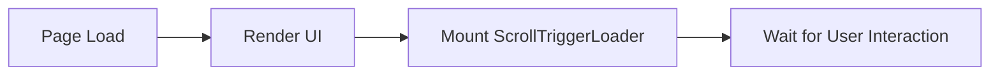
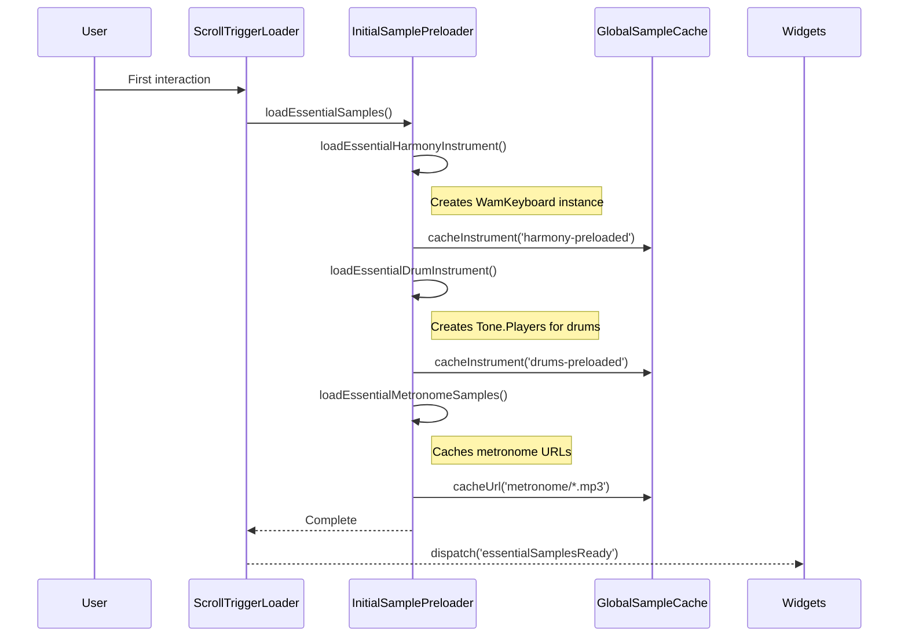
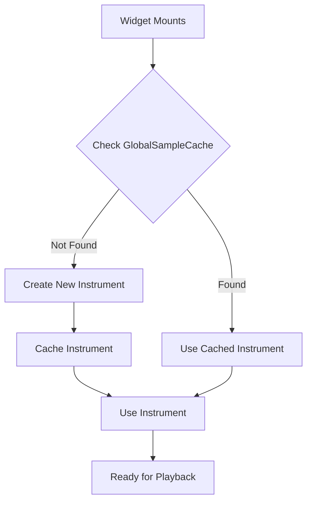

# Sample Loading Flow Documentation

## Overview

The unified sample loading system implements a progressive 3-phase loading strategy that optimizes initial page load, provides instant playback on first user interaction, and progressively enhances the experience with full sample sets.

## System Architecture

```
┌─────────────────────────────────────────────────────────────┐
│                    Sample Loading System                      │
├─────────────────────────────────────────────────────────────┤
│                                                               │
│  ┌─────────────────┐    ┌──────────────────┐                │
│  │ScrollTriggerLoader│   │InitialSamplePreloader│            │
│  │                 │    │                  │                │
│  │ Detects first  │───▶│ Phase 2: Creates │                │
│  │ user gesture   │    │ instruments      │                │
│  └─────────────────┘    └────────┬─────────┘                │
│                                  │                           │
│                                  ▼                           │
│                        ┌─────────────────┐                   │
│                        │GlobalSampleCache │                   │
│                        │                  │                   │
│                        │ Stores created  │                   │
│                        │ instruments     │                   │
│                        └────────┬────────┘                   │
│                                 │                            │
│  ┌──────────────────────────────┼──────────────────────┐    │
│  │              Widgets check cache first              │    │
│  │  ┌─────────┐  ┌─────────┐  ┌─────────┐  ┌────────┐│    │
│  │  │Drummer  │  │Harmony  │  │Bass     │  │Metronome││    │
│  │  │Widget   │  │Widget   │  │Widget   │  │Widget  ││    │
│  │  └─────────┘  └─────────┘  └─────────┘  └────────┘│    │
│  └────────────────────────────────────────────────────┘    │
└─────────────────────────────────────────────────────────────┘
```

## Loading Phases

### Phase 1: Initial Page Load (0ms)
- **What happens**: Nothing! Zero loading, zero memory usage
- **Why**: Fastest possible initial page load
- **Code location**: Page components render without audio initialization



### Phase 2: First User Interaction (scroll/click/touch)
- **Trigger**: ScrollTriggerLoader detects first user gesture
- **What happens**: 
  - AudioContext initialized/resumed
  - Essential samples loaded
  - Instruments created and cached
- **Duration**: ~100-300ms
- **Code location**: `InitialSamplePreloader.loadEssentialSamples()`



### Phase 3: Progressive Enhancement (background)
- **Trigger**: After Phase 2 completes
- **What happens**: Load full sample sets, additional velocity layers
- **Duration**: 1-5 seconds (background)
- **Code location**: `InitialSamplePreloader.loadFullSamples()`

```mermaid
graph TB
    A[Phase 2 Complete] --> B[loadFullSamples()]
    B --> C[Load Additional Harmony Samples]
    B --> D[Load Additional Drum Samples]
    B --> E[Load Bass Samples]
    B --> F[Load Full Metronome Set]
    C --> G[Update Cache]
    D --> G
    E --> G
    F --> G
    G --> H[Set __samplesPreloaded = true]
```

## Widget Loading Pattern

All widgets follow the same cache-first pattern:



### Example Code Pattern

```typescript
// In widget component
const loadInstrument = async () => {
  // 1. Check cache first
  const cached = GlobalSampleCache.getCachedInstrument('harmony-preloaded');
  if (cached) {
    instrumentRef.current = cached;
    setLoaded(true);
    return;
  }

  // 2. Create if not cached (fallback)
  const context = await ensureAudioContext();
  const instrument = await createInstrument(context);
  
  // 3. Cache for other widgets
  GlobalSampleCache.cacheInstrument('harmony-preloaded', instrument);
  
  instrumentRef.current = instrument;
  setLoaded(true);
};
```

## Cache Keys

| Instrument | Cache Key | Created In |
|------------|-----------|------------|
| Harmony/Piano | `'harmony-preloaded'` | Phase 2 |
| Drums | `'drums-preloaded'` | Phase 2 |
| Bass | `'bass-preloaded'` | Future (Phase 3) |
| Metronome | `'metronome-preloaded'` | Future (Phase 3) |

## Performance Metrics

### Before (Multiple Loading Systems)
- Initial load: 2-5 seconds (loading all samples)
- Memory usage: 150-200MB (duplicate instruments)
- First playback: 50-200ms delay

### After (Unified System)
- Initial load: 0ms (nothing loads)
- Phase 2: 100-300ms (essential samples only)
- Memory usage: 50-80MB (single instances)
- First playback: <5ms (pre-created instruments)

## File Locations

- **ScrollTriggerLoader**: `/domains/playback/components/ScrollTriggerLoader.tsx`
- **InitialSamplePreloader**: `/domains/playback/services/InitialSamplePreloader.ts`
- **GlobalSampleCache**: `/domains/playback/services/storage/GlobalSampleCache.ts`
- **Widget Integration**: `/domains/widgets/components/YouTubeWidgetPage/components/*.tsx`

## Key Benefits

1. **Zero Initial Load**: Page loads instantly with no audio initialization
2. **User-Triggered Loading**: Respects browser audio policies
3. **Instant Playback**: Instruments pre-created and ready
4. **Memory Efficient**: Single instances shared across widgets
5. **Progressive Enhancement**: Full quality loads in background
6. **Cache-First**: Prevents duplicate loading

## Migration Guide

For widgets using the old loading pattern:

### Old Pattern
```typescript
// Each widget loaded independently
const loadSamples = async () => {
  const sampler = new Tone.Sampler({...});
  await Tone.loaded();
  setSamplesLoaded(true);
};
```

### New Pattern
```typescript
// Check cache first
const loadSamples = async () => {
  const cached = GlobalSampleCache.getCachedInstrument('drums-preloaded');
  if (cached) {
    drumPadsRef.current = cached;
    setSamplesLoaded(true);
    return;
  }
  // Fallback to creating new (rare case)
};
```

## Debugging

Enable debug logging:
```javascript
// In browser console
localStorage.setItem('DEBUG_AUDIO', 'true');
```

Check cache stats:
```javascript
GlobalSampleCache.getStats()
// Returns: { samplesCount, instrumentsCount, totalSize }
```

Monitor loading phases:
```javascript
window.addEventListener('essentialSamplesReady', () => {
  console.log('Phase 2 complete');
});

window.addEventListener('samplesPreloaded', () => {
  console.log('Phase 3 complete');
});
```

## Future Enhancements

1. **Intelligent Preloading**: Detect which widgets are on the page and only load their samples
2. **Sample Quality Selection**: Load different quality based on connection speed
3. **Memory Management**: Automatic cleanup of unused samples after timeout
4. **Offline Support**: Cache samples in IndexedDB for offline use