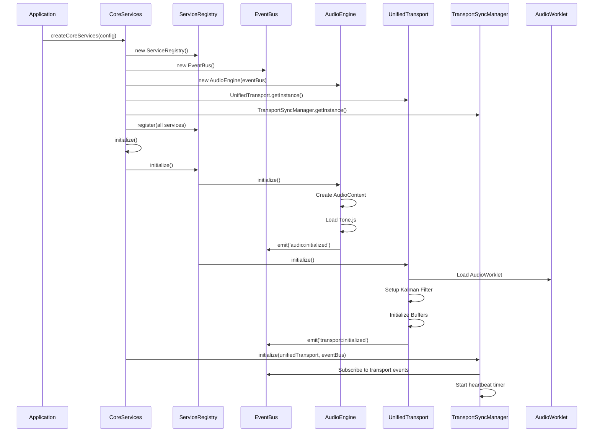
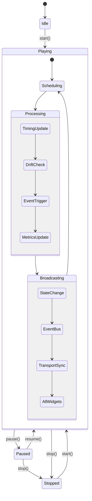
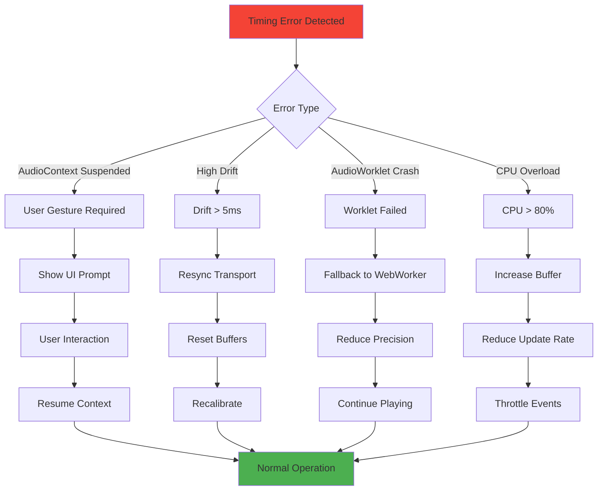
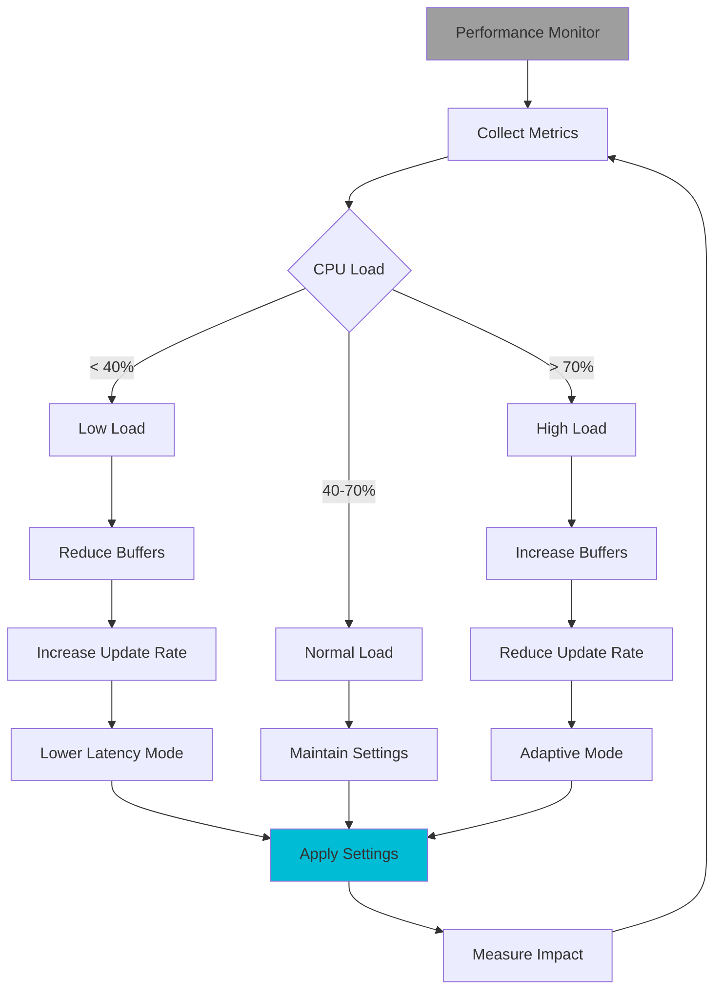

# UnifiedTransport Data Flow Diagrams

## 1. System Initialization Flow



## 2. Play Command Flow

```mermaid
flowchart TD
    A[User Clicks Play] --> B[React Component]
    B --> C{useTransport Hook}
    C --> D[TransportCommands.play()]
    D --> E[UnifiedTransport.start()]

    E --> F[Validate State]
    F --> G[Resume AudioContext]
    G --> H[Reset Position]
    H --> I[Start Timing Sources]

    I --> J[AudioWorklet.start()]
    I --> K[WebWorker.start()]
    I --> L[RAF Timer.start()]

    J --> M[Emit transport:play]
    K --> M
    L --> M

    M --> N[EventBus]
    N --> O[TransportSyncManager]
    O --> P[Broadcast to Widgets]

    P --> Q[Widget A]
    P --> R[Widget B]
    P --> S[Widget C]

    style A fill:#4CAF50
    style E fill:#2196F3
    style J fill:#FF9800
    style N fill:#9C27B0
```

## 3. Timing Update Pipeline (Every 2.67ms)

```mermaid
flowchart LR
    subgraph AudioWorklet
        A[process()] --> B[128 samples]
        B --> C[postMessage]
    end

    subgraph MainThread
        C --> D[UnifiedTransport]
        D --> E[Measure Drift]
        E --> F[Kalman Filter]
        F --> G[Predict Next]
        G --> H[Schedule Events]
    end

    subgraph Scheduling
        H --> I{Buffer Check}
        I -->|Active| J[Execute Now]
        I -->|Future| K[Queue Event]
        K --> L[Triple Buffer]
    end

    subgraph Execution
        J --> M[Trigger Callbacks]
        M --> N[Update Metrics]
        N --> O{Drift > 1ms?}
        O -->|Yes| P[Compensate]
        O -->|No| Q[Continue]
    end

    style A fill:#FF5722
    style F fill:#03A9F4
    style L fill:#8BC34A
```

## 4. Widget Synchronization Flow



## 5. Error Recovery Flow



## 6. Performance Optimization Flow



## 7. Event Priority Queue

```
┌─────────────────────────────────────────┐
│          Event Priority Queue           │
├─────────────────────────────────────────┤
│ CRITICAL (0-10ms)                       │
│ • Beat triggers                         │
│ • Note on/off events                    │
│ • Loop boundaries                       │
├─────────────────────────────────────────┤
│ HIGH (10-50ms)                          │
│ • Tempo changes                         │
│ • Time signature changes                │
│ • Section markers                       │
├─────────────────────────────────────────┤
│ NORMAL (50-200ms)                       │
│ • UI updates                            │
│ • Visual feedback                       │
│ • Progress indicators                   │
├─────────────────────────────────────────┤
│ LOW (200ms+)                            │
│ • Analytics events                      │
│ • Debug logging                         │
│ • Performance metrics                   │
└─────────────────────────────────────────┘
```

## 8. Memory Management

```
┌──────────────────────────────────────────────┐
│            Triple Buffer System              │
├──────────────────────────────────────────────┤
│                                              │
│  Active Buffer     Scheduling     Standby    │
│  ┌──────────┐     ┌──────────┐  ┌─────────┐│
│  │▓▓▓▓▓▓▓▓▓▓│     │░░░░░░    │  │         ││
│  │▓▓▓▓▓▓▓▓▓▓│     │░░░░░░░░  │  │         ││
│  │▓▓▓▓▓▓▓▓  │ --> │░░░░░░░░░░│  │         ││
│  │          │     │░░░░░░░░░░│  │         ││
│  └──────────┘     └──────────┘  └─────────┘│
│   Playing Now      Filling Up    Ready Next │
│                                              │
│  Rotation: Active → Standby → Scheduling    │
└──────────────────────────────────────────────┘
```

## Key Insights

1. **Separation of Concerns**: Each service has a single responsibility
2. **Event-Driven**: Loose coupling through EventBus
3. **Fault Tolerant**: Multiple fallback mechanisms
4. **Performance Adaptive**: Dynamic optimization based on load
5. **Professional Grade**: Comparable to desktop DAW architectures
