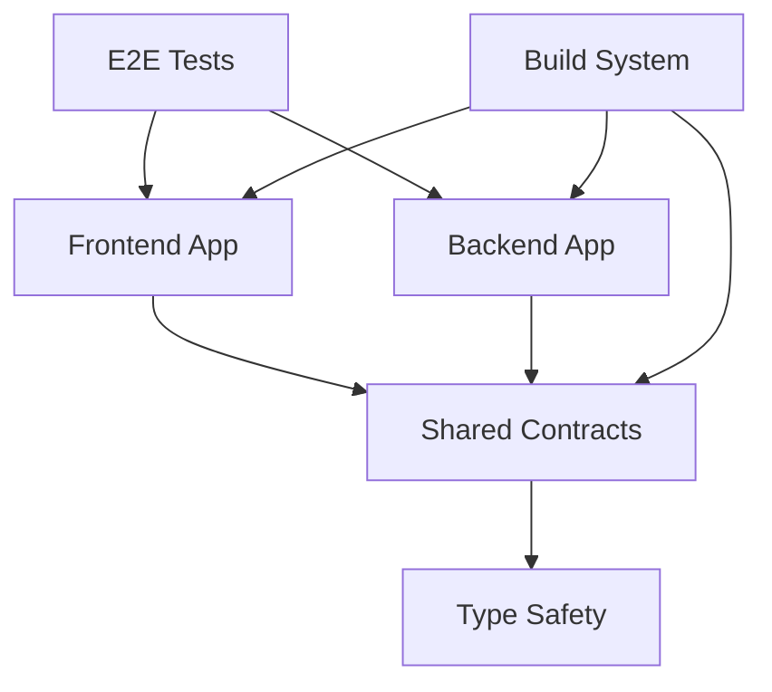

# BassNotion System Patterns

## Architectural Overview

### **Domain-Driven Design (DDD)**
BassNotion follows domain-driven design principles with clear separation of concerns:

```
├── domains/
│   ├── user/           # User management and authentication
│   ├── learning/       # Educational content and progression
│   ├── playback/       # Audio playback and practice tools
│   ├── content/        # Content management and organization
│   ├── analysis/       # Audio processing and analytics
│   ├── social/         # Community and collaboration features
│   └── widgets/        # Reusable UI components and tools
```

### **Monorepo Architecture Pattern**



**Key Benefits:**
- **Shared Types**: Single source of truth for API contracts
- **Coordinated Releases**: Synchronized frontend/backend deployments
- **Code Reuse**: Shared utilities and components
- **Consistent Tooling**: Unified linting, testing, and build processes

### **Layered Architecture Pattern**

#### **Frontend Layers**
```
┌─ Pages/Routes (Next.js App Router)
├─ Components (UI Components)
├─ Hooks (Business Logic)
├─ Services (API Communication)
├─ Stores (State Management)
└─ Infrastructure (External Dependencies)
```

#### **Backend Layers**
```
┌─ Controllers (HTTP/WebSocket Endpoints)
├─ Services (Business Logic)
├─ Repositories (Data Access)
├─ Entities (Domain Models)
└─ Infrastructure (Database/External APIs)
```

## Design Patterns

### **Component Architecture Pattern**

#### **Frontend Component Structure**
```typescript
// Domain-specific component organization
domains/user/components/
├── auth/
│   ├── LoginForm.tsx
│   ├── RegisterForm.tsx
│   └── index.ts
├── profile/
│   ├── ProfileSettings.tsx
│   ├── AvatarUpload.tsx
│   └── index.ts
└── index.ts
```

#### **Component Design Principles**
1. **Single Responsibility**: Each component has one clear purpose
2. **Composition over Inheritance**: Use component composition patterns
3. **Props Interface**: Strict TypeScript interfaces for all props
4. **Controlled Components**: Manage state through props and callbacks
5. **Error Boundaries**: Graceful error handling at component level

### **State Management Pattern**

#### **Frontend State Architecture**
```typescript
// Zustand for client state
interface UserStore {
  user: User | null;
  preferences: UserPreferences;
  setUser: (user: User) => void;
  updatePreferences: (prefs: Partial<UserPreferences>) => void;
}

// React Query for server state
const useUserData = (userId: string) => {
  return useQuery({
    queryKey: ['user', userId],
    queryFn: () => userService.getUser(userId),
    staleTime: 5 * 60 * 1000, // 5 minutes
  });
};
```

#### **State Management Principles**
- **Client State**: Zustand for UI state, user preferences, temporary data
- **Server State**: React Query for API data, caching, and synchronization
- **Form State**: React Hook Form for form management and validation
- **Global State**: Minimal global state, prefer local component state

### **Service Layer Pattern**

#### **Backend Service Structure**
```typescript
@Injectable()
export class UserService {
  constructor(
    private readonly userRepository: UserRepository,
    private readonly eventEmitter: EventEmitter2,
  ) {}

  async createUser(dto: CreateUserDto): Promise<User> {
    // 1. Validate input
    // 2. Business logic
    // 3. Persist data
    // 4. Emit events
    // 5. Return result
  }
}
```

#### **Frontend Service Structure**
```typescript
class UserApiService {
  private baseUrl = '/api/users';

  async getUser(id: string): Promise<User> {
    const response = await fetch(`${this.baseUrl}/${id}`);
    if (!response.ok) throw new ApiError(response);
    return response.json();
  }

  async updateUser(id: string, data: UpdateUserDto): Promise<User> {
    // HTTP client with error handling
  }
}
```

### **Repository Pattern**

#### **Data Access Layer**
```typescript
@Injectable()
export class UserRepository {
  constructor(private readonly supabase: SupabaseClient) {}

  async findById(id: string): Promise<User | null> {
    const { data, error } = await this.supabase
      .from('users')
      .select('*')
      .eq('id', id)
      .single();

    if (error && error.code !== 'PGRST116') throw error;
    return data ? this.mapToEntity(data) : null;
  }

  private mapToEntity(row: any): User {
    // Map database row to domain entity
  }
}
```

### **Event-Driven Pattern**

#### **Domain Events**
```typescript
// Event definition
export class UserRegisteredEvent {
  constructor(public readonly user: User) {}
}

// Event emission
@Injectable()
export class UserService {
  async registerUser(dto: RegisterUserDto): Promise<User> {
    const user = await this.createUser(dto);
    
    // Emit domain event
    this.eventEmitter.emit('user.registered', new UserRegisteredEvent(user));
    
    return user;
  }
}

// Event handling
@Injectable()
export class EmailService {
  @OnEvent('user.registered')
  async handleUserRegistered(event: UserRegisteredEvent) {
    await this.sendWelcomeEmail(event.user);
  }
}
```

## Error Handling Patterns

### **Frontend Error Handling**

#### **React Error Boundaries**
```typescript
export class ErrorBoundary extends Component<Props, State> {
  constructor(props: Props) {
    super(props);
    this.state = { hasError: false };
  }

  static getDerivedStateFromError(error: Error): State {
    return { hasError: true };
  }

  componentDidCatch(error: Error, errorInfo: ErrorInfo) {
    console.error('Error caught by boundary:', error, errorInfo);
    // Send to error tracking service
  }
}
```

#### **API Error Handling**
```typescript
class ApiError extends Error {
  constructor(
    public readonly response: Response,
    message?: string
  ) {
    super(message || `API Error: ${response.status}`);
  }
}

const handleApiError = (error: unknown) => {
  if (error instanceof ApiError) {
    switch (error.response.status) {
      case 401:
        // Redirect to login
        break;
      case 403:
        // Show permission error
        break;
      default:
        // Generic error handling
    }
  }
};
```

### **Backend Error Handling**

#### **Global Exception Filter**
```typescript
@Catch()
export class GlobalExceptionFilter implements ExceptionFilter {
  catch(exception: unknown, host: ArgumentsHost) {
    const ctx = host.switchToHttp();
    const response = ctx.getResponse();
    const request = ctx.getRequest();

    let status = HttpStatus.INTERNAL_SERVER_ERROR;
    let message = 'Internal server error';

    if (exception instanceof HttpException) {
      status = exception.getStatus();
      message = exception.message;
    }

    response.status(status).json({
      statusCode: status,
      timestamp: new Date().toISOString(),
      path: request.url,
      message,
    });
  }
}
```

## Testing Patterns

### **Frontend Testing Strategy**

#### **Component Testing**
```typescript
describe('LoginForm', () => {
  it('should validate required fields', async () => {
    render(<LoginForm onSubmit={mockSubmit} />);
    
    const submitButton = screen.getByRole('button', { name: /login/i });
    await userEvent.click(submitButton);
    
    expect(screen.getByText(/email is required/i)).toBeInTheDocument();
    expect(screen.getByText(/password is required/i)).toBeInTheDocument();
  });
});
```

#### **Hook Testing**
```typescript
describe('useUserData', () => {
  it('should fetch user data', async () => {
    const { result } = renderHook(() => useUserData('user-1'), {
      wrapper: QueryClientProvider,
    });

    await waitFor(() => {
      expect(result.current.isSuccess).toBe(true);
    });

    expect(result.current.data).toEqual(mockUser);
  });
});
```

### **Backend Testing Strategy**

#### **Service Testing**
```typescript
describe('UserService', () => {
  it('should create user with valid data', async () => {
    const dto: CreateUserDto = { email: 'test@example.com', name: 'Test User' };
    const mockUser = { id: '1', ...dto };

    mockUserRepository.create.mockResolvedValue(mockUser);

    const result = await userService.createUser(dto);

    expect(result).toEqual(mockUser);
    expect(mockUserRepository.create).toHaveBeenCalledWith(dto);
  });
});
```

#### **E2E Testing**
```typescript
describe('User Registration Flow', () => {
  it('should register new user successfully', async () => {
    await page.goto('/register');
    
    await page.fill('input[name="email"]', 'test@example.com');
    await page.fill('input[name="password"]', 'SecurePassword123');
    await page.click('button[type="submit"]');
    
    await expect(page).toHaveURL('/dashboard');
    await expect(page.locator('h1')).toContainText('Welcome');
  });
});
```

## Security Patterns

### **Authentication & Authorization**

#### **JWT Token Handling**
```typescript
// Frontend token management
class AuthService {
  private tokenKey = 'auth_token';

  getToken(): string | null {
    return localStorage.getItem(this.tokenKey);
  }

  setToken(token: string): void {
    localStorage.setItem(this.tokenKey, token);
  }

  removeToken(): void {
    localStorage.removeItem(this.tokenKey);
  }
}
```

#### **API Request Interceptor**
```typescript
// Automatic token injection
const apiClient = axios.create({
  baseURL: process.env.NEXT_PUBLIC_API_URL,
});

apiClient.interceptors.request.use((config) => {
  const token = authService.getToken();
  if (token) {
    config.headers.Authorization = `Bearer ${token}`;
  }
  return config;
});
```

### **Input Validation Pattern**

#### **DTO Validation**
```typescript
export class CreateUserDto {
  @IsEmail()
  @IsNotEmpty()
  email: string;

  @IsString()
  @MinLength(8)
  @MaxLength(128)
  password: string;

  @IsString()
  @Length(2, 50)
  name: string;
}
```

#### **Frontend Form Validation**
```typescript
const schema = z.object({
  email: z.string().email('Invalid email address'),
  password: z.string().min(8, 'Password must be at least 8 characters'),
  name: z.string().min(2, 'Name must be at least 2 characters'),
});

const form = useForm<FormData>({
  resolver: zodResolver(schema),
});
```

## Performance Patterns

### **Caching Strategy**

#### **Frontend Caching**
```typescript
// React Query caching configuration
const queryClient = new QueryClient({
  defaultOptions: {
    queries: {
      staleTime: 5 * 60 * 1000, // 5 minutes
      cacheTime: 10 * 60 * 1000, // 10 minutes
      retry: 3,
      refetchOnWindowFocus: false,
    },
  },
});
```

#### **Backend Caching**
```typescript
@Injectable()
export class UserService {
  @Cacheable('users', 300) // 5 minutes TTL
  async getUser(id: string): Promise<User> {
    return this.userRepository.findById(id);
  }
}
```

### **Code Splitting Pattern**

#### **Dynamic Imports**
```typescript
// Lazy load heavy components
const AudioAnalyzer = lazy(() => import('./AudioAnalyzer.js'));
const PlaybackControls = lazy(() => import('./PlaybackControls.js'));

export function PracticeSession() {
  return (
    <Suspense fallback={<LoadingSpinner />}>
      <AudioAnalyzer />
      <PlaybackControls />
    </Suspense>
  );
}
```

These patterns ensure BassNotion maintains high code quality, performance, and maintainability while scaling effectively. 